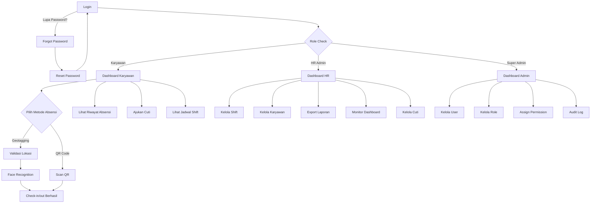

# Product Requirements Document (PRD)

## 1. Project Overview

### Vision

HadirYuk adalah sistem absensi karyawan kantor berbasis web yang modern, akurat, dan mudah digunakan. Sistem ini menggabungkan teknologi geotagging, face recognition, dan QR code untuk memastikan keabsahan data kehadiran karyawan.

### Background

Banyak perusahaan masih menggunakan sistem absensi manual atau semi-digital yang rentan terhadap kecurangan seperti titip absen, manipulasi waktu, atau ketidakakuratan data kehadiran. HadirYuk hadir sebagai solusi digital yang mengintegrasikan validasi lokasi (geotagging), validasi identitas (face recognition), dan kemudahan akses (QR code) dalam satu platform terpadu.

### Specific Goals

- Mengurangi kecurangan absensi hingga 95% dengan validasi ganda (lokasi + wajah)
- Mempermudah proses check-in/out karyawan dengan multiple metode
- Menyediakan laporan absensi yang akurat dan dapat diexport
- Memberikan dashboard real-time untuk monitoring kehadiran
- Mendukung manajemen shift dan pengajuan cuti yang terstruktur

## 2. Target Audience

### User Personas

| Persona         | Deskripsi                                                       | Pain Points                                                              |
| --------------- | --------------------------------------------------------------- | ------------------------------------------------------------------------ |
| **Karyawan**    | Karyawan kantor yang melakukan absensi harian                   | Lupa absen, antri lama saat check-in, sistem yang rumit                  |
| **HR Admin**    | Administrator yang mengelola data karyawan dan absensi          | Data absensi tidak akurat, sulit membuat laporan, manajemen shift manual |
| **Super Admin** | Administrator sistem yang mengelola user, role, dan konfigurasi | Tidak ada kontrol akses yang jelas, sulit audit perubahan                |

### Demographics

- **Perusahaan**: UKM hingga mid-size company (50 karyawan)
- **Industri**: Semua industri yang memiliki karyawan kantor
- **Lokasi**: Multi-kantor/cabang dengan radius geotagging berbeda

## 3. User Stories

| ID     | Role        | Requirement                                                  | Benefit                                | Priority    |
| ------ | ----------- | ------------------------------------------------------------ | -------------------------------------- | ----------- |
| US-001 | Karyawan    | Saya bisa check-in menggunakan geotagging + face recognition | Absensi saya tervalidasi dengan akurat | Must Have   |
| US-002 | Karyawan    | Saya bisa check-in menggunakan QR Code                       | Alternatif absensi yang cepat          | Must Have   |
| US-003 | Karyawan    | Saya bisa check-out dengan metode yang sama                  | Data kehadiran lengkap                 | Must Have   |
| US-004 | Karyawan    | Saya bisa melihat riwayat absensi saya                       | Monitoring kehadiran pribadi           | Must Have   |
| US-005 | Karyawan    | Saya bisa mengajukan cuti                                    | Proses pengajuan cuti terdigitalisasi  | Must Have   |
| US-006 | HR Admin    | Saya bisa membuat dan mengelola shift                        | Penjadwalan karyawan terstruktur       | Must Have   |
| US-007 | HR Admin    | Saya bisa melihat dashboard kehadiran real-time              | Monitoring kehadiran seluruh karyawan  | Must Have   |
| US-008 | HR Admin    | Saya bisa mengexport laporan absensi                         | Laporan untuk keperluan administrasi   | Must Have   |
| US-009 | HR Admin    | Saya bisa mengelola data karyawan                            | Data karyawan terpusat                 | Must Have   |
| US-010 | HR Admin    | Saya bisa mengelola pengajuan cuti karyawan                  | Data cuti tercatat dengan baik         | Must Have   |
| US-011 | Super Admin | Saya bisa membuat dan mengelola role                         | Kontrol akses yang fleksibel           | Must Have   |
| US-012 | Super Admin | Saya bisa assign permission ke role                          | Keamanan sistem terjamin               | Must Have   |
| US-013 | Super Admin | Saya bisa mengelola user dan assign role                     | Manajemen user terstruktur             | Must Have   |
| US-014 | Karyawan    | Saya bisa melihat jadwal shift saya                          | Mengetahui jam kerja yang berlaku      | Should Have |
| US-015 | HR Admin    | Saya bisa mengassign shift ke karyawan                       | Penjadwalan otomatis                   | Should Have |
| US-016 | Karyawan    | Saya bisa melihat sisa cuti saya                             | Planning cuti lebih baik               | Should Have |
| US-017 | HR Admin    | Saya bisa mengkonfigurasi lokasi kantor dengan radius        | Validasi geotagging akurat             | Should Have |
| US-018 | Super Admin | Saya bisa melihat audit log sistem                           | Traceability perubahan                 | Could Have  |
| US-019 | Karyawan    | Saya bisa update profil dan foto wajah                       | Data face recognition akurat           | Must Have   |
| US-020 | HR Admin    | Saya bisa melihat statistik keterlambatan                    | Identifikasi pola keterlambatan        | Should Have |
| US-021 | Semua       | Saya bisa reset password jika lupa                           | Recovery akses akun                    | Must Have   |
| US-022 | HR Admin    | Saya bisa mengkoreksi data absensi                           | Perbaikan data absensi yang salah      | Should Have |
| US-023 | HR Admin    | Saya bisa generate dan revoke QR Code                        | Manajemen QR code untuk absensi        | Should Have |

## 4. Key Features & MoSCoW

### Must Have

| Fitur                    | Deskripsi                                                          |
| ------------------------ | ------------------------------------------------------------------ |
| Geotagging Check-in/out  | Validasi lokasi saat absensi dengan radius yang bisa dikonfigurasi |
| Face Recognition         | Validasi identitas saat check-in geotagging                        |
| QR Code Check-in/out     | Alternatif absensi dengan scan QR Code                             |
| Shift Management         | CRUD shift, assign shift ke karyawan                               |
| User Management          | CRUD data karyawan                                                 |
| UAM (Role & Permissions) | Manajemen role dan permission                                      |
| Leave Management         | Input cuti tanpa approval                                          |
| Dashboard                | Dashboard kehadiran real-time                                      |
| Export Report            | Export laporan ke Excel/PDF                                        |
| Forgot/Reset Password    | Recovery password jika lupa                                        |

### Should Have

| Fitur                   | Deskripsi                                      |
| ----------------------- | ---------------------------------------------- |
| Jadwal Shift View       | Karyawan bisa melihat jadwal shift mereka      |
| Sisa Cuti View          | Karyawan bisa melihat sisa cuti                |
| Lokasi Kantor Config    | Konfigurasi multi-lokasi dengan radius berbeda |
| Statistik Keterlambatan | Laporan keterlambatan karyawan                 |
| Attendance Correction   | Koreksi data absensi oleh HR Admin             |
| QR Code Management      | Generate dan revoke QR code                    |

### Could Have

| Fitur            | Deskripsi                 |
| ---------------- | ------------------------- |
| Audit Log        | Log perubahan data sistem |
| Notifikasi Email | Reminder check-in/out     |

### Won't Have (v1)

| Fitur               | Alasan                  |
| ------------------- | ----------------------- |
| Overtime Detection  | Tidak dibutuhkan        |
| Approval Workflow   | Tidak dibutuhkan        |
| Payroll Integration | Dilakukan manual        |
| Device Whitelist    | Tidak dibutuhkan        |
| Mobile App          | Web-based only untuk v1 |

## 5. High-Level User Flow

## 6. Non-Functional Requirements

### Security

- Password di-hash menggunakan bcrypt
- JWT untuk authentication dengan expiry 24 jam
- Face recognition data dienkripsi
- Rate limiting pada endpoint login dan absensi

### Scalability

- Mendukung hingga 50 user terdaftar
- Max 10 concurrent connections
- Database MySQL dengan indexing optimal
- Stateless API design untuk horizontal scaling

### Performance

- Response time API < 500ms untuk 95% request
- Face recognition processing < 3 detik
- QR Code scan response < 1 detik
- Dashboard load time < 2 detik

### Reliability

- Uptime target: 99.5%
- Graceful error handling dengan user-friendly messages

### Usability

- UI responsive (desktop & mobile browser)
- Bahasa Indonesia sebagai default
- Minimal training untuk pengguna baru
- Accessibility WCAG 2.1 Level AA

### Timezone & Localization

- Semua timestamp disimpan dalam UTC di database
- Konversi ke WIB (UTC+7) dilakukan di layer presentation (frontend)
- Format tanggal: DD/MM/YYYY untuk tampilan Indonesia
- Format waktu: 24-hour format (HH:mm)

### Data Retention

- Attendance records: retained indefinitely (audit requirement)
- Audit logs: retained for 12 months
- Password reset tokens: deleted after use or expiry (1 hour)
- QR codes: soft-deleted after expiry, hard-deleted after 30 days
- Face photos: retained while employee is active, archived 30 days after deactivation

## 7. Success Metrics

| KPI                             | Target               |
| ------------------------------- | -------------------- |
| Akurasi absensi                 | > 99%                |
| False positive face recognition | < 1%                 |
| User adoption rate              | > 90% dalam 2 minggu |
| Average check-in time           | < 10 detik           |
| System uptime                   | > 99.5%              |
| User satisfaction score         | > 4.0/5.0            |

## 8. Constraints & Assumptions

### Constraints

- Budget terbatas untuk infrastruktur (shared hosting/VPS basic)
- Tidak ada integrasi dengan sistem payroll existing
- Web-based only, tidak ada native mobile app
- Face recognition menggunakan library open-source

### Assumptions

- Karyawan memiliki smartphone dengan kamera dan GPS
- Koneksi internet tersedia di lokasi kantor
- Admin HR memiliki akses komputer untuk manajemen
- Browser support minimum:
  - Chrome 100+ (Primary target)
  - Firefox 100+ (Full support)
  - Safari 15+ (iOS Safari for mobile web)
  - Edge 100+ (Chromium-based only)
- Foto wajah karyawan sudah tersedia saat onboard
