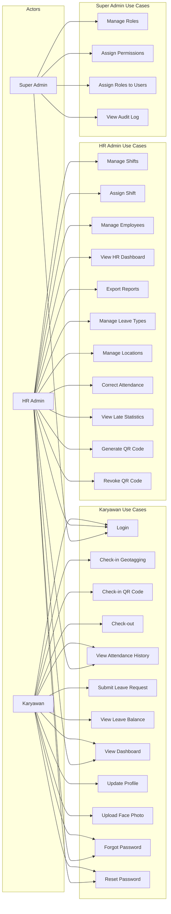
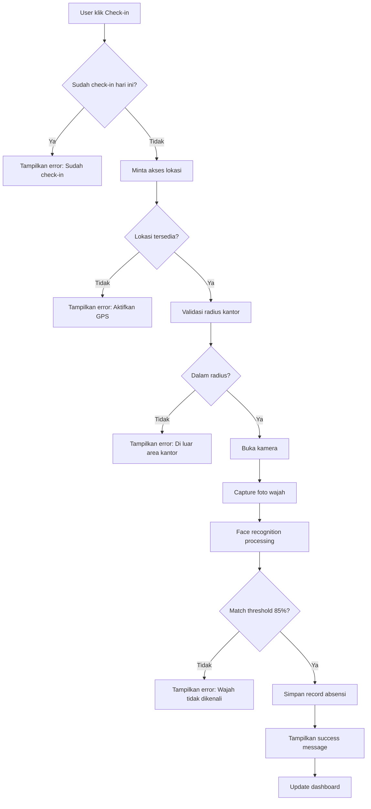
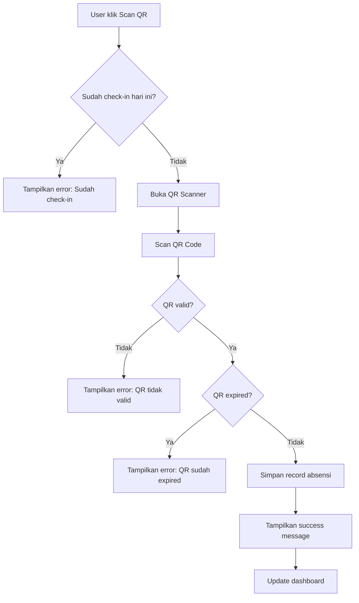
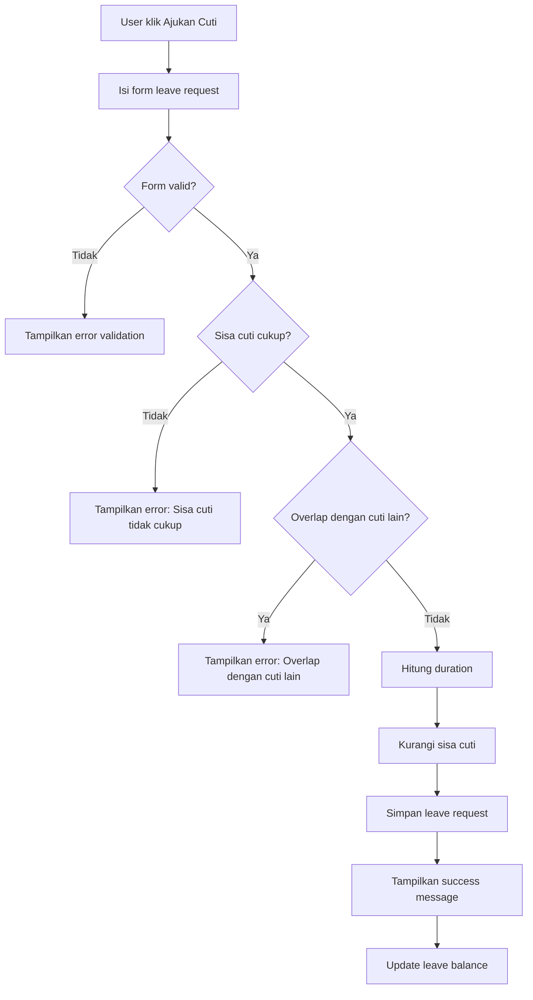

# Functional Specification Document (FSD)

## 1. Functional Hierarchy

```
HadirYuk
├── Authentication & Authorization
│   ├── Login
│   ├── Logout
│   ├── Token Refresh
│   ├── Password Change
│   ├── Forgot Password
│   └── Reset Password
├── Attendance (Absensi)
│   ├── Check-in (Geotagging + Face Recognition)
│   ├── Check-in (QR Code)
│   ├── Check-out (Geotagging + Face Recognition)
│   ├── Check-out (QR Code)
│   ├── Attendance History
│   └── Attendance Correction
├── Shift Management
│   ├── Create Shift
│   ├── Edit Shift
│   ├── Delete Shift
│   ├── View Shift List
│   ├── Assign Shift to Employee
│   └── Shift Schedule View
├── Leave Management
│   ├── Submit Leave Request
│   ├── View Leave History
│   ├── View Leave Balance
│   └── Manage Leave Types (Admin)
├── User Management
│   ├── Create Employee
│   ├── Edit Employee
│   ├── Deactivate Employee
│   ├── View Employee List
│   ├── Employee Detail
│   └── Upload Face Photo
├── UAM (Role & Permissions)
│   ├── Create Role
│   ├── Edit Role
│   ├── Delete Role
│   ├── Assign Permissions to Role
│   ├── Assign Role to User
│   └── View Permission List
├── Dashboard
│   ├── Karyawan Dashboard
│   ├── HR Dashboard
│   └── Admin Dashboard
├── Location Management
│   ├── Add Office Location
│   ├── Edit Office Location
│   ├── Delete Office Location
│   └── Set Geofence Radius
├── Reporting
│   ├── Attendance Report
│   ├── Leave Report
│   ├── Late Statistics
│   ├── Export to Excel
│   └── Export to PDF
├── QR Code Management
│   ├── Generate QR Code
│   ├── View Active QR Codes
│   └── Revoke QR Code
├── Audit Log
│   └── View Audit Log
└── Profile
    ├── View Profile
    ├── Edit Profile
    └── Update Face Photo
```

## 2. Detailed Functional Requirements

### 2.1 Authentication & Authorization

#### 2.1.1 Login

- **Pre-condition:** User sudah terdaftar di sistem
- **Business Logic:**
  - User input email dan password
  - Sistem validasi kredensial
  - Jika valid, generate JWT token (access + refresh)
  - Jika invalid, return error message
  - Rate limiting: max 5 attempts per 15 menit
- **Post-condition:** User mendapat token dan redirect ke dashboard sesuai role

#### 2.1.2 Logout

- **Pre-condition:** User sudah login
- **Business Logic:**
  - Invalidate JWT token
  - Clear session di client
- **Post-condition:** User kembali ke halaman login

#### 2.1.3 Password Change

- **Pre-condition:** User sudah login
- **Business Logic:**
  - User input current password, new password, confirm password
  - Validasi current password benar
  - Validasi new password memenuhi kriteria (min 8 char, alphanumeric)
  - Validasi new password != current password
  - Hash dan simpan password baru
- **Post-condition:** Password berhasil diubah, user perlu login ulang

#### 2.1.4 Forgot Password

- **Pre-condition:** User terdaftar di sistem
- **Business Logic:**
  - User input email terdaftar
  - Sistem generate reset token dengan expiry 1 jam
  - Simpan token ke PASSWORD_RESET_TOKENS table
  - Kirim email dengan reset link (token sebagai parameter)
  - Token hanya bisa digunakan sekali
- **Post-condition:** Email reset terkirim, token tersimpan

#### 2.1.5 Reset Password

- **Pre-condition:** User memiliki valid reset token
- **Business Logic:**
  - User input token, new password, confirm password
  - Validasi token ada, belum expired, belum digunakan
  - Validasi new password memenuhi kriteria
  - Hash dan simpan password baru
  - Mark token sebagai used
- **Post-condition:** Password berhasil diubah, token marked as used

### 2.2 Attendance (Absensi)

#### 2.2.1 Check-in (Geotagging + Face Recognition)

- **Pre-condition:** User login, belum check-in hari ini
- **Business Logic:**
  - User klik tombol Check-in
  - Browser meminta akses lokasi (GPS)
  - Validasi lokasi dalam radius kantor yang diassign
  - Jika lokasi valid, buka kamera untuk face recognition
  - Capture foto dan bandingkan dengan foto terdaftar
  - Jika match (threshold > 85%), simpan record absensi
  - Catat: user_id, timestamp, latitude, longitude, method=geotagging, photo_url
  - Jika lokasi tidak valid, tampilkan error "Anda berada di luar area kantor"
  - Jika face tidak match, tampilkan error "Wajah tidak dikenali"
- **Post-condition:** Record absensi tersimpan, status check-in tercatat

#### 2.2.2 Check-in (QR Code)

- **Pre-condition:** User login, belum check-in hari ini, QR Code tersedia di kantor
- **Business Logic:**
  - User klik tombol Scan QR
  - Buka kamera untuk scan QR Code
  - Validasi QR Code (format, expiry, lokasi)
  - QR Code berisi: office_id, timestamp_hash, signature
  - Jika valid, simpan record absensi
  - Catat: user_id, timestamp, method=qr_code, qr_code_id
  - QR Code di-generate oleh sistem dengan expiry 5 menit
- **Post-condition:** Record absensi tersimpan, status check-in tercatat

#### 2.2.3 Check-out

- **Pre-condition:** User sudah check-in hari ini, belum check-out
- **Business Logic:**
  - Sama seperti check-in dengan validasi yang sama
  - Validasi check-out time >= shift start time + minimum work hours
  - Catat: user_id, check_in_time, check_out_time, duration
- **Post-condition:** Record absensi diupdate dengan check-out time

#### 2.2.4 Attendance History

- **Pre-condition:** User login
- **Business Logic:**
  - Karyawan: hanya bisa melihat riwayat sendiri
  - HR Admin: bisa melihat riwayat semua karyawan dengan filter
  - Filter: date range, employee, status (present, late, absent)
  - Pagination: 20 records per page
  - Sort by date descending
- **Post-condition:** Data riwayat ditampilkan

#### 2.2.5 Attendance Correction

- **Pre-condition:** HR Admin login, attendance record ada
- **Business Logic:**
  - HR Admin pilih attendance record yang perlu dikoreksi
  - Input: check_in_time baru, check_out_time baru, reason
  - Validasi: reason tidak kosong
  - Update record dengan corrected_by, corrected_at, correction_reason
  - Catat perubahan ke audit log
- **Post-condition:** Attendance record terkoreksi, audit log tercatat

### 2.3 Shift Management

#### 2.3.1 Create Shift

- **Pre-condition:** HR Admin login
- **Business Logic:**
  - Input: shift name, start time, end time, break duration, color code
  - Validasi: nama shift unik, end time > start time
  - Hitung total work hours otomatis
  - Simpan shift
- **Post-condition:** Shift baru tersimpan

#### 2.3.2 Assign Shift to Employee

- **Pre-condition:** HR Admin login, shift dan employee ada
- **Business Logic:**
  - Pilih employee dan shift
  - Tentukan effective date (kapan shift berlaku)
  - Bisa assign multiple employee sekaligus
  - Validasi: employee belum punya shift aktif di tanggal yang sama
- **Post-condition:** Employee ter-assign ke shift

#### 2.3.3 Shift Schedule View

- **Pre-condition:** User login
- **Business Logic:**
  - Tampilkan kalender dengan shift yang diassign
  - Karyawan: hanya jadwal sendiri
  - HR Admin: bisa lihat jadwal semua karyawan
  - Warna sesuai color code shift
- **Post-condition:** Jadwal shift ditampilkan

### 2.4 Leave Management

#### 2.4.1 Submit Leave Request

- **Pre-condition:** Karyawan login, sisa cuti > 0
- **Business Logic:**
  - Input: leave type, start date, end date, reason
  - Validasi: end date >= start date
  - Validasi: duration <= sisa cuti
  - Validasi: tidak overlap dengan leave yang sudah ada
  - Hitung duration otomatis (exclude weekend)
  - Simpan leave request dengan status "submitted"
  - Tanpa approval workflow, langsung tercatat
- **Post-condition:** Leave request tersimpan, sisa cuti berkurang

#### 2.4.2 View Leave Balance

- **Pre-condition:** User login
- **Business Logic:**
  - Tampilkan total cuti tahunan
  - Tampilkan cuti yang sudah digunakan
  - Tampilkan sisa cuti
  - Breakdown per leave type
- **Post-condition:** Sisa cuti ditampilkan

### 2.5 Late Statistics

#### 2.5.1 View Late Statistics

- **Pre-condition:** HR Admin login
- **Business Logic:**
  - Filter: date range, employee, department
  - Hitung: total late days, average late minutes, trend
  - Tampilkan detail per hari: check_in time, late minutes
  - Tampilkan grafik trend keterlambatan
- **Post-condition:** Statistik keterlambatan ditampilkan

### 2.6 User Management

#### 2.6.1 Create Employee

- **Pre-condition:** HR Admin login
- **Business Logic:**
  - Input: name, email, phone, department, position, join date, shift
  - Validasi: email unik, format email valid
  - Generate default password (karyawan bisa ganti setelah login pertama)
  - Upload foto wajah untuk face recognition
  - Simpan user dengan role "employee" default
- **Post-condition:** Employee baru tersimpan

#### 2.6.2 Upload Face Photo

- **Pre-condition:** User login
- **Business Logic:**
  - User upload foto atau capture dari kamera
  - Validasi: format JPG/PNG, max size 2MB
  - Validasi: wajah terdeteksi dalam foto
  - Simpan foto dan generate face embedding
  - Bisa upload multiple foto untuk akurasi lebih baik
- **Post-condition:** Foto wajah tersimpan, face embedding tergenerate

### 2.7 UAM (Role & Permissions)

#### 2.7.1 Create Role

- **Pre-condition:** Super Admin login
- **Business Logic:**
  - Input: role name, description
  - Validasi: nama role unik
  - Simpan role
- **Post-condition:** Role baru tersimpan

#### 2.7.2 Assign Permissions to Role

- **Pre-condition:** Super Admin login, role ada
- **Business Logic:**
  - Tampilkan list semua permission
  - Pilih permission yang akan diassign (checkbox)
  - Simpan mapping role-permission
- **Post-condition:** Permission terassign ke role

#### 2.7.3 Assign Role to User

- **Pre-condition:** Super Admin login, user dan role ada
- **Business Logic:**
  - Pilih user dan role
  - Satu user bisa punya multiple role
  - Simpan mapping user-role
- **Post-condition:** User terassign ke role

### 2.8 Dashboard

#### 2.8.1 Karyawan Dashboard

- **Pre-condition:** Karyawan login
- **Business Logic:**
  - Tampilkan status kehadiran hari ini (checked-in, checked-out, absent)
  - Tampilkan jam kerja shift hari ini
  - Tampilkan quick action: Check-in, Check-out
  - Tampilkan ringkasan bulanan: hadir, telat, absen, cuti
  - Tampilkan jadwal shift minggu ini
- **Post-condition:** Dashboard ditampilkan

#### 2.8.2 HR Dashboard

- **Pre-condition:** HR Admin login
- **Business Logic:**
  - Tampilkan statistik hari ini: hadir, telat, belum absen, cuti
  - Tampilkan chart kehadiran 7 hari terakhir
  - Tampilkan list karyawan yang belum absen
  - Tampilkan leave request terbaru
  - Quick action: export laporan, kelola shift
- **Post-condition:** Dashboard ditampilkan

### 2.9 Location Management

#### 2.9.1 Add Office Location

- **Pre-condition:** HR Admin login
- **Business Logic:**
  - Input: office name, address, latitude, longitude, radius (meter)
  - Validasi: latitude/longitude valid format
  - Validasi: radius antara 50-500 meter
  - Simpan lokasi
- **Post-condition:** Lokasi kantor tersimpan

### 2.10 Reporting

#### 2.10.1 Attendance Report

- **Pre-condition:** HR Admin login
- **Business Logic:**
  - Filter: date range, employee, department, status
  - Generate report dengan data: nama, tanggal, check-in, check-out, duration, status, method
  - Hitung summary: total hadir, telat, absen, cuti
- **Post-condition:** Report ditampilkan

#### 2.10.2 Export to Excel

- **Pre-condition:** HR Admin login, report sudah di-generate
- **Business Logic:**
  - Convert report data ke format Excel (.xlsx)
  - Format: header, data rows, summary row
  - Download file
- **Post-condition:** File Excel terdownload

#### 2.10.3 Export to PDF

- **Pre-condition:** HR Admin login, report sudah di-generate
- **Business Logic:**
  - Convert report data ke format PDF
  - Format: header, company logo, data table, summary
  - Download file
- **Post-condition:** File PDF terdownload

### 2.11 QR Code Management

#### 2.11.1 Generate QR Code

- **Pre-condition:** HR Admin login
- **Business Logic:**
  - Pilih office location
  - Set expiry time (default 5 menit)
  - Generate QR code dengan signature
  - Simpan ke QR_CODES table
  - Return QR code image (base64) untuk ditampilkan
- **Post-condition:** QR code tersimpan dan siap ditampilkan

#### 2.11.2 View Active QR Codes

- **Pre-condition:** HR Admin login
- **Business Logic:**
  - Tampilkan list QR codes yang masih aktif
  - Filter by office location
  - Tampilkan: office, expires_at, status
- **Post-condition:** List QR codes aktif ditampilkan

#### 2.11.3 Revoke QR Code

- **Pre-condition:** HR Admin login, QR code ada
- **Business Logic:**
  - Pilih QR code yang akan di-revoke
  - Set is_active = false
  - Invalidasi QR code untuk scanning
- **Post-condition:** QR code tidak bisa digunakan lagi

### 2.12 Audit Log (Could Have)

#### 2.12.1 View Audit Log

- **Pre-condition:** Super Admin login
- **Business Logic:**
  - Filter: date range, user, entity type
  - Tampilkan: user, action, entity, old values, new values, timestamp
  - Pagination: 20 records per page
  - Sort by timestamp descending
- **Post-condition:** Audit log ditampilkan

## 3. User Interaction & Screen Elements

### Login Page

| Element Name    | Type           | Validation Rules             |
| --------------- | -------------- | ---------------------------- |
| Email           | Input text     | Required, valid email format |
| Password        | Input password | Required, min 8 characters   |
| Login Button    | Button         | Disabled if form invalid     |
| Forgot Password | Link           | Navigate to reset password   |

### Forgot Password Page

| Element Name    | Type       | Validation Rules             |
| --------------- | ---------- | ---------------------------- |
| Email           | Input text | Required, valid email format |
| Send Reset Link | Button     | Disabled if email invalid    |
| Back to Login   | Link       | Navigate to login            |

### Reset Password Page

| Element Name     | Type           | Validation Rules                    |
| ---------------- | -------------- | ----------------------------------- |
| New Password     | Input password | Required, min 8 chars, alphanumeric |
| Confirm Password | Input password | Required, must match new password   |
| Reset Button     | Button         | Disabled if form invalid            |

### Karyawan Dashboard

| Element Name      | Type     | Validation Rules               |
| ----------------- | -------- | ------------------------------ |
| Check-in Button   | Button   | Disabled if already checked-in |
| Check-out Button  | Button   | Disabled if not checked-in     |
| Attendance Status | Badge    | Present/Late/Absent            |
| Monthly Summary   | Card     | Auto-calculated                |
| Shift Schedule    | Calendar | Current week only              |

### Attendance Check-in (Geotagging)

| Element Name    | Type   | Validation Rules               |
| --------------- | ------ | ------------------------------ |
| Location Status | Badge  | In-range/Out-of-range          |
| Camera Preview  | Video  | Required for face capture      |
| Capture Button  | Button | Enabled only if location valid |
| Result Message  | Alert  | Success/Error message          |

### Attendance Check-in (QR Code)

| Element Name | Type   | Validation Rules |
| ------------ | ------ | ---------------- |
| QR Scanner   | Camera | Required         |
| Scan Result  | Alert  | Valid/Invalid QR |
| Retry Button | Button | If scan failed   |

### Shift Management

| Element Name   | Type         | Validation Rules         |
| -------------- | ------------ | ------------------------ |
| Shift Name     | Input text   | Required, unique         |
| Start Time     | Time picker  | Required                 |
| End Time       | Time picker  | Required, > start time   |
| Break Duration | Number       | Required, in minutes     |
| Color Code     | Color picker | Required                 |
| Save Button    | Button       | Disabled if form invalid |

### Leave Request

| Element Name  | Type        | Validation Rules         |
| ------------- | ----------- | ------------------------ |
| Leave Type    | Dropdown    | Required                 |
| Start Date    | Date picker | Required, >= today       |
| End Date      | Date picker | Required, >= start date  |
| Reason        | Textarea    | Required, max 500 chars  |
| Submit Button | Button      | Disabled if form invalid |

### User Management

| Element Name | Type        | Validation Rules               |
| ------------ | ----------- | ------------------------------ |
| Name         | Input text  | Required                       |
| Email        | Input text  | Required, unique, valid format |
| Phone        | Input text  | Required, valid phone format   |
| Department   | Dropdown    | Required                       |
| Position     | Input text  | Required                       |
| Join Date    | Date picker | Required                       |
| Face Photo   | File upload | JPG/PNG, max 2MB               |
| Save Button  | Button      | Disabled if form invalid       |

### Role Management

| Element Name    | Type           | Validation Rules         |
| --------------- | -------------- | ------------------------ |
| Role Name       | Input text     | Required, unique         |
| Description     | Textarea       | Required                 |
| Permission List | Checkbox group | At least 1 selected      |
| Save Button     | Button         | Disabled if form invalid |

### Attendance Correction

| Element Name      | Type            | Validation Rules           |
| ----------------- | --------------- | -------------------------- |
| Check-in Time     | DateTime picker | Required                   |
| Check-out Time    | DateTime picker | Required, >= check-in time |
| Correction Reason | Textarea        | Required, max 500 chars    |
| Submit Button     | Button          | Disabled if form invalid   |

### QR Code Management

| Element Name     | Type     | Validation Rules         |
| ---------------- | -------- | ------------------------ |
| Office Location  | Dropdown | Required                 |
| Expiry Minutes   | Number   | Required, 1-60 minutes   |
| Generate Button  | Button   | Disabled if form invalid |
| QR Image Preview | Image    | Auto-generated           |
| Active QR List   | Table    | Shows active codes       |
| Revoke Button    | Button   | Per QR code row          |

## 4. Use Case Diagram



## 5. Feature Logic Flow

### Check-in (Geotagging + Face Recognition) Flow



### Check-in (QR Code) Flow



### Leave Request Flow



## 6. Error Handling & Validation

| Trigger                            | Error Message                                           | System Resolution               |
| ---------------------------------- | ------------------------------------------------------- | ------------------------------- |
| Invalid email/password saat login  | "Email atau password salah"                             | Tidak ada aksi, user bisa retry |
| Rate limit login exceeded          | "Terlalu banyak percobaan. Coba lagi dalam 15 menit"    | Block login selama 15 menit     |
| GPS tidak tersedia                 | "Aktifkan GPS untuk absensi"                            | Redirect ke settings            |
| Lokasi di luar radius              | "Anda berada di luar area kantor"                       | Tidak simpan absensi            |
| Face recognition gagal             | "Wajah tidak dikenali. Pastikan pencahayaan cukup"      | Retry capture                   |
| Sudah check-in hari ini            | "Anda sudah check-in hari ini"                          | Disable check-in button         |
| Belum check-out saat check-in      | "Silakan check-out terlebih dahulu"                     | Redirect ke check-out           |
| QR Code invalid                    | "QR Code tidak valid"                                   | Retry scan                      |
| QR Code expired                    | "QR Code sudah expired. Scan ulang"                     | Request new QR                  |
| Sisa cuti tidak cukup              | "Sisa cuti tidak mencukupi"                             | Disable submit                  |
| Leave overlap                      | "Tanggal cuti overlap dengan cuti yang sudah ada"       | Highlight tanggal conflict      |
| Email sudah terdaftar              | "Email sudah digunakan"                                 | Disable submit                  |
| File upload terlalu besar          | "Ukuran file maksimal 2MB"                              | Reject upload                   |
| Format foto tidak valid            | "Format file harus JPG/PNG"                             | Reject upload                   |
| Wajah tidak terdeteksi di foto     | "Wajah tidak terdeteksi. Pastikan wajah terlihat jelas" | Retry upload                    |
| Permission denied                  | "Anda tidak memiliki akses ke fitur ini"                | Redirect ke dashboard           |
| Session expired                    | "Session expired. Silakan login ulang"                  | Redirect ke login               |
| Network error                      | "Koneksi internet bermasalah"                           | Retry request                   |
| Server error                       | "Terjadi kesalahan. Silakan coba lagi"                  | Log error, retry                |
| Invalid shift time                 | "Jam selesai harus lebih dari jam mulai"                | Disable submit                  |
| Shift name duplicate               | "Nama shift sudah ada"                                  | Disable submit                  |
| Role name duplicate                | "Nama role sudah ada"                                   | Disable submit                  |
| Reset token expired                | "Link reset sudah expired. Request ulang"               | Redirect ke forgot password     |
| Reset token invalid                | "Token tidak valid"                                     | Redirect ke forgot password     |
| Reset token already used           | "Token sudah digunakan"                                 | Redirect ke login               |
| Attendance correction reason empty | "Alasan koreksi harus diisi"                            | Disable submit                  |
| QR code generation failed          | "Gagal generate QR code"                                | Retry request                   |
| No active QR code                  | "Tidak ada QR code aktif"                               | Generate new QR                 |
