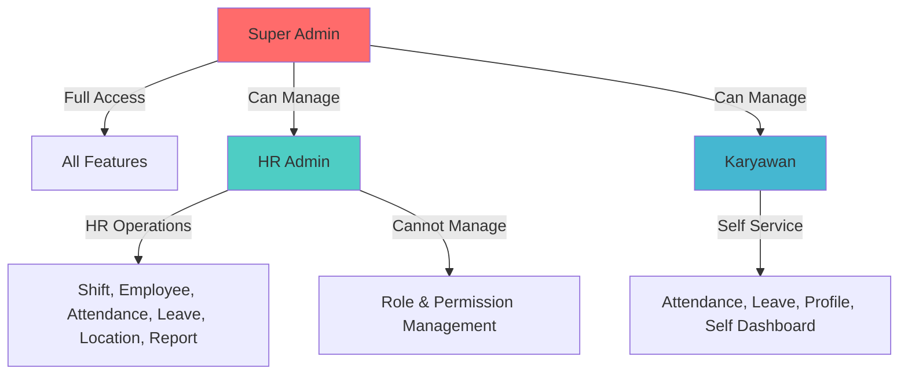

# Role & Permissions Matrix

## 1. User Roles Definition

| Role Name | Description | Access Level |
|-----------|-------------|--------------|
| **Super Admin** | Administrator tertinggi sistem yang memiliki akses penuh ke semua fitur termasuk manajemen user, role, dan permission. Role ini biasanya dipegang oleh IT Administrator atau System Owner. | Full Access |
| **HR Admin** | Administrator yang bertanggung jawab atas manajemen operasional HR seperti pengelolaan karyawan, shift, absensi, cuti, dan laporan. Role ini dipegang oleh staf HR atau manager. | HR Operations |
| **Karyawan** | Pengguna biasa yang menggunakan sistem untuk melakukan absensi, melihat jadwal, mengajukan cuti, dan melihat riwayat kehadiran mereka sendiri. | Self Service |

## 2. Permissions List

| Permission | Module | Action | Description |
|------------|--------|--------|-------------|
| `auth.login` | auth | login | Can login to system |
| `auth.logout` | auth | logout | Can logout from system |
| `auth.forgot-password` | auth | forgot-password | Can request password reset |
| `auth.reset-password` | auth | reset-password | Can reset password with token |
| `auth.change-password` | auth | change-password | Can change own password |
| `profile.view` | profile | view | Can view own profile |
| `profile.update` | profile | update | Can update own profile |
| `profile.upload-face` | profile | upload-face | Can upload face photo |
| `attendance.checkin` | attendance | checkin | Can check-in attendance |
| `attendance.checkout` | attendance | checkout | Can check-out attendance |
| `attendance.view` | attendance | view | Can view own attendance history |
| `attendance.view-all` | attendance | view-all | Can view all attendance history |
| `attendance.export` | attendance | export | Can export attendance report |
| `attendance.correct` | attendance | correct | Can correct attendance record |
| `shift.index` | shift | index | Can view shift list |
| `shift.create` | shift | create | Can create new shift |
| `shift.update` | shift | update | Can update shift |
| `shift.delete` | shift | delete | Can delete shift |
| `shift.assign` | shift | assign | Can assign shift to employee |
| `leave.submit` | leave | submit | Can submit leave request |
| `leave.view` | leave | view | Can view own leave history |
| `leave.view-all` | leave | view-all | Can view all leave history |
| `leave.manage-types` | leave | manage-types | Can manage leave types |
| `user.index` | user | index | Can view user list |
| `user.create` | user | create | Can create new user |
| `user.update` | user | update | Can update user |
| `user.delete` | user | delete | Can delete/deactivate user |
| `user.assign-role` | user | assign-role | Can assign role to user |
| `role.index` | role | index | Can view role list |
| `role.create` | role | create | Can create new role |
| `role.update` | role | update | Can update role |
| `role.delete` | role | delete | Can delete role |
| `role.assign-permission` | role | assign-permission | Can assign permission to role |
| `permission.index` | permission | index | Can view permission list |
| `permission.create` | permission | create | Can create new permission |
| `permission.update` | permission | update | Can update permission |
| `permission.delete` | permission | delete | Can delete permission |
| `location.index` | location | index | Can view location list |
| `location.create` | location | create | Can create new location |
| `location.update` | location | update | Can update location |
| `location.delete` | location | delete | Can delete location |
| `dashboard.view` | dashboard | view | Can view own dashboard |
| `dashboard.view-hr` | dashboard | view-hr | Can view HR dashboard |
| `dashboard.view-admin` | dashboard | view-admin | Can view admin dashboard |
| `report.view` | report | view | Can view reports |
| `report.export-excel` | report | export-excel | Can export report to Excel |
| `report.export-pdf` | report | export-pdf | Can export report to PDF |
| `qrcode.generate` | qrcode | generate | Can generate QR code |
| `qrcode.view` | qrcode | view | Can view active QR codes |
| `qrcode.revoke` | qrcode | revoke | Can revoke QR code |
| `audit.view` | audit | view | Can view audit log |
| `late-statistic.view` | late-statistic | view | Can view late statistics |

## 3. The Matrix Table

| Permission | Super Admin | HR Admin | Karyawan |
|------------|-------------|----------|----------|
| **Authentication & Profile** | | | |
| `auth.login` | ✅ | ✅ | ✅ |
| `auth.logout` | ✅ | ✅ | ✅ |
| `auth.forgot-password` | ✅ | ✅ | ✅ |
| `auth.reset-password` | ✅ | ✅ | ✅ |
| `auth.change-password` | ✅ | ✅ | ✅ |
| `profile.view` | ✅ | ✅ | ✅ |
| `profile.update` | ✅ | ✅ | ✅ |
| `profile.upload-face` | ✅ | ✅ | ✅ |
| **Attendance** | | | |
| `attendance.checkin` | ✅ | ✅ | ✅ |
| `attendance.checkout` | ✅ | ✅ | ✅ |
| `attendance.view` | ✅ | ✅ | ✅ |
| `attendance.view-all` | ✅ | ✅ | ❌ |
| `attendance.export` | ✅ | ✅ | ❌ |
| `attendance.correct` | ✅ | ✅ | ❌ |
| **Shift** | | | |
| `shift.index` | ✅ | ✅ | ✅ |
| `shift.create` | ✅ | ✅ | ❌ |
| `shift.update` | ✅ | ✅ | ❌ |
| `shift.delete` | ✅ | ✅ | ❌ |
| `shift.assign` | ✅ | ✅ | ❌ |
| **Leave** | | | |
| `leave.submit` | ✅ | ✅ | ✅ |
| `leave.view` | ✅ | ✅ | ✅ |
| `leave.view-all` | ✅ | ✅ | ❌ |
| `leave.manage-types` | ✅ | ✅ | ❌ |
| **User Management** | | | |
| `user.index` | ✅ | ✅ | ❌ |
| `user.create` | ✅ | ✅ | ❌ |
| `user.update` | ✅ | ✅ | ❌ |
| `user.delete` | ✅ | ❌ | ❌ |
| `user.assign-role` | ✅ | ❌ | ❌ |
| **Role Management** | | | |
| `role.index` | ✅ | ❌ | ❌ |
| `role.create` | ✅ | ❌ | ❌ |
| `role.update` | ✅ | ❌ | ❌ |
| `role.delete` | ✅ | ❌ | ❌ |
| `role.assign-permission` | ✅ | ❌ | ❌ |
| **Permission** | | | |
| `permission.index` | ✅ | ❌ | ❌ |
| `permission.create` | ✅ | ❌ | ❌ |
| `permission.update` | ✅ | ❌ | ❌ |
| `permission.delete` | ✅ | ❌ | ❌ |
| **Location** | | | |
| `location.index` | ✅ | ✅ | ❌ |
| `location.create` | ✅ | ✅ | ❌ |
| `location.update` | ✅ | ✅ | ❌ |
| `location.delete` | ✅ | ✅ | ❌ |
| **Dashboard** | | | |
| `dashboard.view` | ✅ | ✅ | ✅ |
| `dashboard.view-hr` | ✅ | ✅ | ❌ |
| `dashboard.view-admin` | ✅ | ❌ | ❌ |
| **Report** | | | |
| `report.view` | ✅ | ✅ | ❌ |
| `report.export-excel` | ✅ | ✅ | ❌ |
| `report.export-pdf` | ✅ | ✅ | ❌ |
| **QR Code** | | | |
| `qrcode.generate` | ✅ | ✅ | ❌ |
| `qrcode.view` | ✅ | ✅ | ❌ |
| `qrcode.revoke` | ✅ | ✅ | ❌ |
| **Audit & Statistics** | | | |
| `audit.view` | ✅ | ❌ | ❌ |
| `late-statistic.view` | ✅ | ✅ | ❌ |

## 4. Role Hierarchy Diagram

## 5. Data Ownership Rules

### Attendance Records
- Karyawan hanya bisa melihat dan export riwayat absensi mereka sendiri
- HR Admin bisa melihat dan export semua riwayat absensi
- Super Admin bisa melihat semua riwayat absensi
- Attendance record tidak bisa dihapus, hanya bisa dikoreksi oleh HR Admin

### Leave Records
- Karyawan hanya bisa melihat dan mengajukan cuti untuk diri sendiri
- HR Admin bisa melihat semua leave records dan manage leave types
- Leave record tidak bisa dihapus setelah submitted

### User Data
- Karyawan hanya bisa update profile mereka sendiri
- HR Admin bisa create, read, update employee data
- Super Admin bisa delete employee (soft delete)
- Face photo hanya bisa diupdate oleh pemilik atau HR Admin

### Shift Data
- Shift adalah data global yang bisa dilihat oleh semua role
- Hanya HR Admin dan Super Admin yang bisa CRUD shift
- Karyawan hanya bisa melihat shift yang diassign ke mereka

### Location Data
- Location data bisa dilihat oleh HR Admin dan Super Admin
- Karyawan hanya bisa melihat lokasi yang diassign ke shift mereka
- Hanya HR Admin dan Super Admin yang bisa CRUD location

### Role & Permission Data
- Hanya Super Admin yang bisa CRUD role dan permission
- Role dan permission assignment hanya bisa dilakukan oleh Super Admin
- HR Admin dan Karyawan tidak bisa melihat role management

## 6. Permission Inheritance Rules

1. **Super Admin** memiliki semua permission secara implisit, tidak perlu diassign
2. **HR Admin** memiliki permission HR Operations secara default, bisa ditambah/dikurangi oleh Super Admin
3. **Karyawan** memiliki permission Self Service secara default, tidak bisa dikurangi
4. Permission bersifat additive: jika user punya multiple roles, permission digabung (union)
5. Delete permission adalah permission paling restricted, hanya Super Admin untuk user management

## 7. Default Role Assignments

| Role | Default Users | Auto-assign |
|------|---------------|-------------|
| Super Admin | First user created (seed) | Yes (on init) |
| HR Admin | HR Staff, HR Manager | Manual by Super Admin |
| Karyawan | All employees | Manual by HR Admin |
