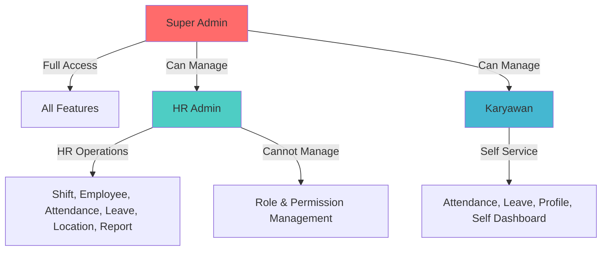

# Role & Permissions Matrix

## 1. User Roles Definition

### Super Admin
Administrator tertinggi sistem yang memiliki akses penuh ke semua fitur termasuk manajemen user, role, dan permission. Role ini biasanya dipegang oleh IT Administrator atau System Owner.

### HR Admin
Administrator yang bertanggung jawab atas manajemen operasional HR seperti pengelolaan karyawan, shift, absensi, cuti, dan laporan. Role ini dipegang oleh staf HR atau manager.

### Karyawan
Pengguna biasa yang menggunakan sistem untuk melakukan absensi, melihat jadwal, mengajukan cuti, dan melihat riwayat kehadiran mereka sendiri.

## 2. Access Levels

### CRUD Definitions
| Level | Deskripsi |
|-------|-----------|
| **Create** | Bisa membuat data baru |
| **Read** | Bisa melihat/membaca data |
| **Update** | Bisa mengedit/mengubah data |
| **Delete** | Bisa menghapus data |
| **None** | Tidak memiliki akses |
| **Self** | Hanya bisa akses data milik sendiri |

### Permission Categories
| Category | Permissions |
|----------|-------------|
| **Attendance** | attendance:checkin, attendance:checkout, attendance:view:self, attendance:view:all, attendance:export, attendance:correct |
| **Shift** | shift:create, shift:read, shift:update, shift:delete, shift:assign |
| **Leave** | leave:submit, leave:view:self, leave:view:all, leave:manage_types |
| **User** | user:create, user:read, user:update, user:delete, user:assign_role |
| **Role** | role:create, role:read, role:update, role:delete, role:assign_permission |
| **Location** | location:create, location:read, location:update, location:delete |
| **Dashboard** | dashboard:view:self, dashboard:view:hr, dashboard:view:admin |
| **Report** | report:view, report:export_excel, report:export_pdf |
| **Profile** | profile:view:self, profile:update:self, profile:upload_face |
| **QR Code** | qrcode:generate, qrcode:view, qrcode:revoke |
| **Audit** | audit:view |
| **Auth** | auth:forgot_password, auth:reset_password |

## 3. The Matrix Table

| Feature Name | Super Admin | HR Admin | Karyawan |
|--------------|-------------|----------|----------|
| **Login/Logout** | CRUD | CRUD | CRUD |
| **Change Password** | Self | Self | Self |
| **View Profile** | Self | Self | Self |
| **Update Profile** | Self | Self | Self |
| **Upload Face Photo** | Self | Self | Self |
| **Check-in (Geotagging)** | ✅ | ✅ | ✅ |
| **Check-in (QR Code)** | ✅ | ✅ | ✅ |
| **Check-out** | ✅ | ✅ | ✅ |
| **View Attendance History (Self)** | Self | Self | Self |
| **View Attendance History (All)** | ✅ | ✅ | None |
| **Export Attendance Report** | ✅ | ✅ | None |
| **Create Shift** | ✅ | ✅ | None |
| **View Shift List** | ✅ | ✅ | Self (assigned only) |
| **Update Shift** | ✅ | ✅ | None |
| **Delete Shift** | ✅ | ✅ | None |
| **Assign Shift to Employee** | ✅ | ✅ | None |
| **View Shift Schedule (Self)** | Self | Self | Self |
| **View Shift Schedule (All)** | ✅ | ✅ | None |
| **Submit Leave Request** | ✅ | ✅ | ✅ |
| **View Leave History (Self)** | Self | Self | Self |
| **View Leave History (All)** | ✅ | ✅ | None |
| **View Leave Balance** | Self | Self | Self |
| **Manage Leave Types** | ✅ | ✅ | None |
| **Create Employee** | ✅ | ✅ | None |
| **View Employee List** | ✅ | ✅ | None |
| **Update Employee** | ✅ | ✅ | None |
| **Delete Employee** | ✅ | None | None |
| **View Employee Detail** | ✅ | ✅ | Self |
| **Create Role** | ✅ | None | None |
| **View Role List** | ✅ | None | None |
| **Update Role** | ✅ | None | None |
| **Delete Role** | ✅ | None | None |
| **Assign Permissions to Role** | ✅ | None | None |
| **Assign Role to User** | ✅ | None | None |
| **Create Office Location** | ✅ | ✅ | None |
| **View Office Location** | ✅ | ✅ | Self (assigned only) |
| **Update Office Location** | ✅ | ✅ | None |
| **Delete Office Location** | ✅ | ✅ | None |
| **View Karyawan Dashboard** | Self | Self | Self |
| **View HR Dashboard** | ✅ | ✅ | None |
| **View Admin Dashboard** | ✅ | None | None |
| **View Audit Log** | ✅ | None | None |
| **Export Report (Excel)** | ✅ | ✅ | None |
| **Export Report (PDF)** | ✅ | ✅ | None |
| **Correct Attendance** | ✅ | ✅ | None |
| **View Late Statistics** | ✅ | ✅ | None |
| **Generate QR Code** | ✅ | ✅ | None |
| **View Active QR Codes** | ✅ | ✅ | None |
| **Revoke QR Code** | ✅ | ✅ | None |
| **Forgot Password** | ✅ | ✅ | ✅ |
| **Reset Password** | ✅ | ✅ | ✅ |

## 4. Role Hierarchy Diagram

## 5. Data Ownership Rules

### Attendance Records
- Karyawan hanya bisa melihat dan export riwayat absensi mereka sendiri
- HR Admin bisa melihat dan export semua riwayat absensi
- Super Admin bisa melihat semua riwayat absensi
- Attendance record tidak bisa dihapus, hanya bisa dikoreksi oleh HR Admin

### Leave Records
- Karyawan hanya bisa melihat dan mengajukan cuti untuk diri sendiri
- HR Admin bisa melihat semua leave records dan manage leave types
- Leave record tidak bisa dihapus setelah submitted

### User Data
- Karyawan hanya bisa update profile mereka sendiri
- HR Admin bisa create, read, update employee data
- Super Admin bisa delete employee (soft delete)
- Face photo hanya bisa diupdate oleh pemilik atau HR Admin

### Shift Data
- Shift adalah data global yang bisa dilihat oleh semua role
- Hanya HR Admin dan Super Admin yang bisa CRUD shift
- Karyawan hanya bisa melihat shift yang diassign ke mereka

### Location Data
- Location data bisa dilihat oleh HR Admin dan Super Admin
- Karyawan hanya bisa melihat lokasi yang diassign ke shift mereka
- Hanya HR Admin dan Super Admin yang bisa CRUD location

### Role & Permission Data
- Hanya Super Admin yang bisa CRUD role dan permission
- Role dan permission assignment hanya bisa dilakukan oleh Super Admin
- HR Admin dan Karyawan tidak bisa melihat role management

## 6. Permission Inheritance Rules

1. **Super Admin** memiliki semua permission secara implisit, tidak perlu diassign
2. **HR Admin** memiliki permission HR Operations secara default, bisa ditambah/dikurangi oleh Super Admin
3. **Karyawan** memiliki permission Self Service secara default, tidak bisa dikurangi
4. Permission bersifat additive: jika user punya multiple roles, permission digabung (union)
5. Delete permission adalah permission paling restricted, hanya Super Admin untuk user management

## 7. Default Role Assignments

| Role | Default Users | Auto-assign |
|------|---------------|-------------|
| Super Admin | First user created (seed) | Yes (on init) |
| HR Admin | HR Staff, HR Manager | Manual by Super Admin |
| Karyawan | All employees | Manual by HR Admin |
