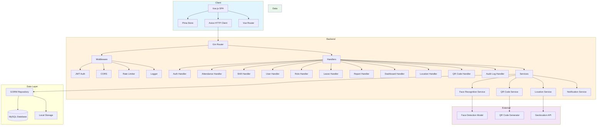
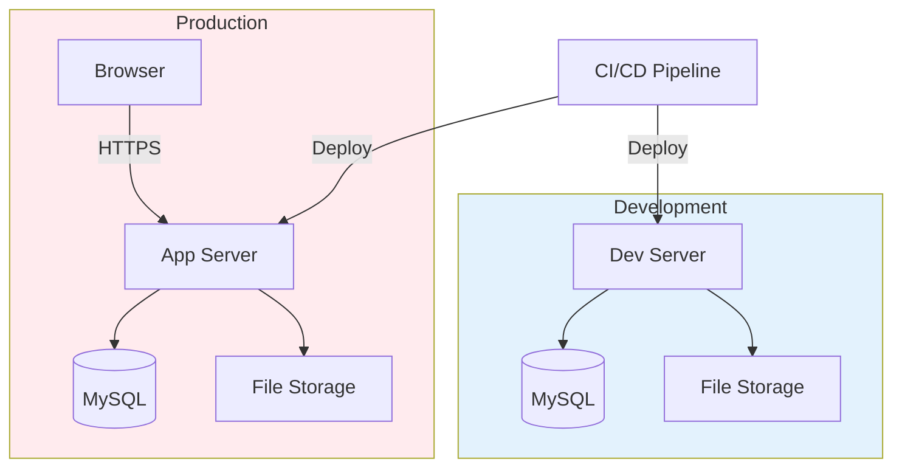
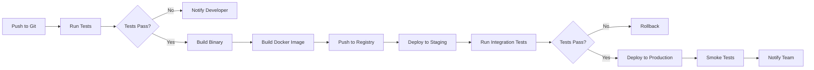

# Technical Design Document (TDD)

## 1. Tech Stack

| Component | Technology | Version | Purpose |
|-----------|------------|---------|---------|
| **Backend Framework** | Go (Golang) + Gin | 1.21+ | REST API development |
| **ORM** | GORM | Latest | Database operations |
| **Database** | MySQL | 8.0+ | Primary data storage |
| **Authentication** | JWT (golang-jwt) | Latest | Token-based auth |
| **Password Hashing** | bcrypt | Built-in | Secure password storage |
| **Face Recognition** | GoCV / face-recognition-go | Latest | Face detection & matching |
| **QR Code** | go-qrcode / tuotoo/qrcode | Latest | QR code generation & scanning |
| **File Storage** | Local Storage / MinIO | - | Photo & document storage |
| **Frontend Framework** | Vue.js 3 | 3.4+ | SPA development |
| **State Management** | Pinia | Latest | Vue state management |
| **HTTP Client** | Axios | Latest | API communication |
| **UI Library** | Element Plus / Ant Design Vue | Latest | UI components |
| **QR Scanner** | vue-qrcode-reader | Latest | QR code scanning |
| **Camera** | vue-webcam / navigator.mediaDevices | - | Camera access |
| **Charts** | Chart.js / ECharts | Latest | Dashboard visualizations |
| **Export Excel** | xlsx / SheetJS | Latest | Excel export |
| **Export PDF** | jsPDF / html2pdf | Latest | PDF export |
| **Migration** | Goose / GORM AutoMigrate | Latest | Database migration |
| **Validation** | go-playground/validator | Latest | Request validation |
| **Logging** | Zap / Logrus | Latest | Structured logging |
| **Environment** | godotenv | Latest | Environment config |

## 2. System Architecture



> **Note**: Notification Service is planned for v2 (email reminders, notifications). Not in scope for v1 per PRD "Could Have" classification.

### Architecture Pattern: Clean Architecture (Modified)

```
cmd/
├── api/                    # Application entry point
├── migrate/                # Database migration CLI

internal/
├── config/                 # Configuration management
├── database/               # Database connection & migration
├── middleware/             # HTTP middleware (auth, cors, etc)
├── handler/                # HTTP handlers (controllers)
├── service/                # Business logic
├── repository/             # Data access layer
├── model/                  # Domain models
├── dto/                    # Data Transfer Objects
├── util/                   # Utility functions
└── pkg/                    # Shared packages

pkg/
├── facerecognition/        # Face recognition wrapper
├── qrcode/                 # QR code utilities
└── geolocation/            # Geolocation utilities

frontend/
├── src/
│   ├── api/                # API service layer
│   ├── components/         # Reusable components
│   ├── views/              # Page components
│   ├── stores/             # Pinia stores
│   ├── router/             # Vue Router config
│   ├── utils/              # Utility functions
│   └── assets/             # Static assets
```

### Geolocation Validation
Server-side geotagging validation menggunakan **Haversine formula** untuk menghitung jarak antara koordinat user dengan koordinat kantor:

```
a = sin²(Δφ/2) + cos φ1 ⋅ cos φ2 ⋅ sin²(Δλ/2)
c = 2 ⋅ atan2(√a, √(1−a))
d = R ⋅ c
```

Dimana:
- φ = latitude (radians), λ = longitude (radians)
- R = earth radius (6371 km)
- d = distance in meters

Jika `d <= office.radius_meters`, maka user dianggap dalam area kantor.

## 3. Entity Relationship Diagram (ERD)

```mermaid
erDiagram
    USERS ||--o{ ATTENDANCES : has
    USERS ||--o{ LEAVE_REQUESTS : submits
    USERS ||--o{ USER_HAS_ROLES : assigned
    USERS ||--o| USER_PROFILES : has
    USERS ||--o{ EMPLOYEE_SHIFTS : assigned
    
    ROLES ||--o{ USER_HAS_ROLES : contains
    ROLES ||--o{ ROLE_HAS_PERMISSIONS : contains
    PERMISSIONS ||--o{ ROLE_HAS_PERMISSIONS : belongs
    
    SHIFTS ||--o{ EMPLOYEE_SHIFTS : assigned
    SHIFTS ||--o{ SHIFT_LOCATIONS : has
    
    OFFICE_LOCATIONS ||--o{ SHIFT_LOCATIONS : used
    OFFICE_LOCATIONS ||--o{ ATTENDANCES : recorded_at
    
    LEAVE_TYPES ||--o{ LEAVE_REQUESTS : categorized
    LEAVE_TYPES ||--o{ LEAVE_BALANCES : tracks
    
    QR_CODES ||--o{ ATTENDANCES : scanned_at
    
    USERS ||--o{ AUDIT_LOGS : generates
    
    USERS ||--o{ TOKEN_BLACKLIST : revokes
    USERS ||--o{ PASSWORD_RESET_TOKENS : requests
    
    USERS {
        bigint id PK
        string email UK
        string password
        string name
        string phone
        string employee_id UK
        enum status
        datetime last_login_at
        datetime created_at
        datetime updated_at
        datetime deleted_at
    }
    
    USER_PROFILES {
        bigint id PK
        bigint user_id FK
        string department
        string position
        date join_date
        string face_photo_url
        string face_embedding
        datetime created_at
        datetime updated_at
    }
    
    ROLES {
        bigint id PK
        string name UK
        string description
        datetime created_at
        datetime updated_at
    }
    
    PERMISSIONS {
        bigint id PK
        string name UK
        string description
        datetime created_at
        datetime updated_at
    }
    
    USER_HAS_ROLES {
        bigint id PK
        bigint user_id FK
        bigint role_id FK
        datetime created_at
    }
    
    ROLE_HAS_PERMISSIONS {
        bigint id PK
        bigint role_id FK
        bigint permission_id FK
        datetime created_at
    }
    
    SHIFTS {
        bigint id PK
        string name UK
        time start_time
        time end_time
        int break_duration
        int minimum_work_hours
        string color_code
        int total_hours
        datetime created_at
        datetime updated_at
        datetime deleted_at
    }
    
    EMPLOYEE_SHIFTS {
        bigint id PK
        bigint user_id FK
        bigint shift_id FK
        date effective_date
        date end_date
        datetime created_at
    }
    
    OFFICE_LOCATIONS {
        bigint id PK
        string name
        string address
        decimal latitude
        decimal longitude
        int radius_meters
        boolean is_active
        datetime created_at
        datetime updated_at
        datetime deleted_at
    }
    
    SHIFT_LOCATIONS {
        bigint id PK
        bigint shift_id FK
        bigint location_id FK
        datetime created_at
    }
    
    ATTENDANCES {
        bigint id PK
        bigint user_id FK
        bigint location_id FK
        bigint qr_code_id FK
        date attendance_date
        datetime check_in_time
        datetime check_out_time
        decimal check_in_lat
        decimal check_in_lng
        decimal check_out_lat
        decimal check_out_lng
        enum check_in_method
        enum check_out_method
        string check_in_photo_url
        string check_out_photo_url
        enum status
        bigint corrected_by FK
        datetime corrected_at
        string correction_reason
        bigint created_by FK
        datetime created_at
        datetime updated_at
    }
    
    LEAVE_TYPES {
        bigint id PK
        string name UK
        string description
        int default_days
        boolean is_paid
        datetime created_at
        datetime updated_at
        datetime deleted_at
    }
    
    LEAVE_REQUESTS {
        bigint id PK
        bigint user_id FK
        bigint leave_type_id FK
        date start_date
        date end_date
        int duration_days
        string reason
        enum status
        bigint created_by FK
        datetime created_at
        datetime updated_at
        datetime deleted_at
    }
    
    LEAVE_BALANCES {
        bigint id PK
        bigint user_id FK
        bigint leave_type_id FK
        int year
        int total_days
        int used_days
        datetime created_at
        datetime updated_at
    }
    
    QR_CODES {
        bigint id PK
        bigint office_id FK
        string code_value UK
        string signature
        datetime expires_at
        boolean is_active
        datetime created_at
        datetime deleted_at
    }
    
    AUDIT_LOGS {
        bigint id PK
        bigint user_id FK
        string action
        string entity_type
        bigint entity_id
        text old_values
        text new_values
        string ip_address
        string user_agent
        datetime created_at
    }
    
    TOKEN_BLACKLIST {
        bigint id PK
        string token_jti UK
        string token_hash
        bigint user_id FK
        datetime expires_at
        datetime created_at
    }
    
    PASSWORD_RESET_TOKENS {
        bigint id PK
        bigint user_id FK
        string token UK
        datetime expires_at
        boolean is_used
        datetime created_at
        datetime used_at
    }
```



### Enum Values

| Enum | Possible Values |
|------|-----------------|
| `USERS.status` | `active`, `inactive`, `suspended` |
| `ATTENDANCES.status` | `present`, `late`, `absent`, `leave`, `half_day` |
| `ATTENDANCES.check_in_method` | `geotagging`, `qr_code` |
| `LEAVE_REQUESTS.status` | `submitted`, `active`, `cancelled`, `expired` |

> **Note**: Leave requests have no approval workflow (per PRD). Status `submitted` means request is recorded, `active` means currently on leave, `cancelled` means employee cancelled, `expired` means past date without action.

## 4. API Contract

### Authentication

| Endpoint | Method | Request Payload | Success Response |
|----------|--------|-----------------|------------------|
| `/api/v1/auth/login` | POST | `{ "email": "string", "password": "string" }` | `{ "access_token": "string", "refresh_token": "string", "user": { "id": 1, "name": "string", "email": "string", "roles": ["string"] } }` |
| `/api/v1/auth/logout` | POST | `{}` | `{ "message": "Logged out successfully" }` |
| `/api/v1/auth/refresh` | POST | `{ "refresh_token": "string" }` | `{ "access_token": "string" }` |
| `/api/v1/auth/change-password` | POST | `{ "current_password": "string", "new_password": "string", "confirm_password": "string" }` | `{ "message": "Password changed successfully" }` |
| `/api/v1/auth/forgot-password` | POST | `{ "email": "string" }` | `{ "message": "Reset link sent to email" }` |
| `/api/v1/auth/reset-password` | POST | `{ "token": "string", "new_password": "string", "confirm_password": "string" }` | `{ "message": "Password reset successfully" }` |

### Attendance

| Endpoint | Method | Request Payload | Success Response |
|----------|--------|-----------------|------------------|
| `/api/v1/attendance/checkin` | POST | `{ "latitude": float, "longitude": float, "photo": "base64" }` | `{ "id": 1, "check_in_time": "2024-01-01T08:00:00Z", "status": "present" }` |
| `/api/v1/attendance/checkin/qr` | POST | `{ "qr_code": "string" }` | `{ "id": 1, "check_in_time": "2024-01-01T08:00:00Z", "status": "present" }` |
| `/api/v1/attendance/checkout` | POST | `{ "latitude": float, "longitude": float, "photo": "base64" }` | `{ "id": 1, "check_out_time": "2024-01-01T17:00:00Z", "duration": "8h 0m" }` |
| `/api/v1/attendance/checkout/qr` | POST | `{ "qr_code": "string" }` | `{ "id": 1, "check_out_time": "2024-01-01T17:00:00Z", "duration": "8h 0m" }` |
| `/api/v1/attendance/history` | GET | `?date_from=YYYY-MM-DD&date_to=YYYY-MM-DD&page=1&limit=20` | `{ "data": [{ "id": 1, "date": "2024-01-01", "check_in": "08:00", "check_out": "17:00", "status": "present" }], "pagination": { "page": 1, "limit": 20, "total": 100 } }` |
| `/api/v1/attendance/today` | GET | - | `{ "status": "checked_in", "check_in_time": "08:00", "shift": { "name": "Regular", "start": "08:00", "end": "17:00" } }` |
| `/api/v1/attendance/stats` | GET | `?month=YYYY-MM` | `{ "present": 20, "late": 2, "absent": 1, "leave": 2 }` |
| `/api/v1/attendance/:id/correct` | PUT | `{ "check_in_time": "2024-01-01T08:00:00Z", "check_out_time": "2024-01-01T17:00:00Z", "reason": "string" }` | `{ "id": 1, "corrected_at": "2024-01-02T10:00:00Z", "corrected_by": 1 }` |
| `/api/v1/attendance/late-statistics` | GET | `?date_from=YYYY-MM-DD&date_to=YYYY-MM-DD&user_id=1` | `{ "data": [{ "date": "2024-01-01", "check_in": "08:15", "late_minutes": 15, "reason": "traffic" }], "summary": { "total_late_days": 5, "avg_late_minutes": 12, "trend": "increasing" } }` |

### Shift

| Endpoint | Method | Request Payload | Success Response |
|----------|--------|-----------------|------------------|
| `/api/v1/shifts` | POST | `{ "name": "string", "start_time": "08:00", "end_time": "17:00", "break_duration": 60, "color_code": "#FF0000" }` | `{ "id": 1, "name": "Regular", "start_time": "08:00", "end_time": "17:00", "total_hours": 8 }` |
| `/api/v1/shifts` | GET | `?page=1&limit=20` | `{ "data": [{ "id": 1, "name": "Regular", "start_time": "08:00", "end_time": "17:00" }], "pagination": {...} }` |
| `/api/v1/shifts/:id` | GET | - | `{ "id": 1, "name": "Regular", "start_time": "08:00", "end_time": "17:00", "break_duration": 60 }` |
| `/api/v1/shifts/:id` | PUT | `{ "name": "string", "start_time": "08:00", "end_time": "17:00", "break_duration": 60 }` | `{ "id": 1, "name": "Regular", ... }` |
| `/api/v1/shifts/:id` | DELETE | - | `{ "message": "Shift deleted successfully" }` |
| `/api/v1/shifts/assign` | POST | `{ "user_ids": [1, 2, 3], "shift_id": 1, "effective_date": "2024-01-01", "end_date": "2024-12-31" }` | `{ "message": "Shift assigned successfully" }` |
| `/api/v1/shifts/schedule` | GET | `?user_id=1&month=YYYY-MM` | `{ "schedule": [{ "date": "2024-01-01", "shift": { "name": "Regular", "start": "08:00", "end": "17:00" } }] }` |

### Leave

| Endpoint | Method | Request Payload | Success Response |
|----------|--------|-----------------|------------------|
| `/api/v1/leave` | POST | `{ "leave_type_id": 1, "start_date": "2024-01-15", "end_date": "2024-01-17", "reason": "string" }` | `{ "id": 1, "leave_type": "Annual", "start_date": "2024-01-15", "end_date": "2024-01-17", "duration": 3, "status": "submitted" }` |
| `/api/v1/leave` | GET | `?page=1&limit=20` | `{ "data": [{ "id": 1, "leave_type": "Annual", "start_date": "2024-01-15", "end_date": "2024-01-17", "duration": 3, "status": "submitted" }], "pagination": {...} }` |
| `/api/v1/leave/balance` | GET | - | `{ "annual": { "total": 12, "used": 5, "remaining": 7 }, "sick": { "total": 10, "used": 2, "remaining": 8 } }` |
| `/api/v1/leave/types` | GET | - | `{ "data": [{ "id": 1, "name": "Annual Leave", "default_days": 12, "is_paid": true }] }` |
| `/api/v1/leave/types` | POST | `{ "name": "string", "default_days": 12, "is_paid": true }` | `{ "id": 1, "name": "string", ... }` |
| `/api/v1/leave/types/:id` | PUT | `{ "name": "string", "default_days": 12, "is_paid": true }` | `{ "id": 1, "name": "string", ... }` |
| `/api/v1/leave/types/:id` | DELETE | - | `{ "message": "Leave type deleted successfully" }` |

### User Management

| Endpoint | Method | Request Payload | Success Response |
|----------|--------|-----------------|------------------|
| `/api/v1/users` | POST | `{ "name": "string", "email": "string", "phone": "string", "department": "string", "position": "string", "join_date": "2024-01-01" }` | `{ "id": 1, "name": "string", "email": "string", "employee_id": "EMP001" }` |
| `/api/v1/users` | GET | `?page=1&limit=20&search=string` | `{ "data": [{ "id": 1, "name": "string", "email": "string", "department": "string" }], "pagination": {...} }` |
| `/api/v1/users/:id` | GET | - | `{ "id": 1, "name": "string", "email": "string", "phone": "string", "department": "string", "position": "string", "join_date": "2024-01-01", "status": "active" }` |
| `/api/v1/users/:id` | PUT | `{ "name": "string", "phone": "string", "department": "string", "position": "string" }` | `{ "id": 1, "name": "string", ... }` |
| `/api/v1/users/:id` | DELETE | - | `{ "message": "User deactivated successfully" }` |
| `/api/v1/users/:id/face-photo` | POST | `multipart/form-data: { "photo": file }` | `{ "message": "Face photo uploaded successfully", "photo_url": "string" }` |

### UAM (Role & Permissions)

| Endpoint | Method | Auth Required | Permission | Request Payload | Success Response |
|----------|--------|---------------|------------|-----------------|------------------|
| `/api/v1/roles` | POST | ✅ | `role.create` | `{ "name": "string", "description": "string" }` | `{ "id": 1, "name": "string", "description": "string" }` |
| `/api/v1/roles` | GET | ✅ | `role.index` | `?page=1&limit=20` | `{ "data": [{ "id": 1, "name": "string", "description": "string", "permissions_count": 10 }], "pagination": {...} }` |
| `/api/v1/roles/:id` | GET | ✅ | `role.index` | - | `{ "id": 1, "name": "string", "description": "string", "permissions": [{ "id": 1, "name": "user.index" }] }` |
| `/api/v1/roles/:id` | PUT | ✅ | `role.update` | `{ "name": "string", "description": "string" }` | `{ "id": 1, "name": "string", ... }` |
| `/api/v1/roles/:id` | DELETE | ✅ | `role.delete` | - | `{ "message": "Role deleted successfully" }` |
| `/api/v1/roles/:id/permissions` | PUT | ✅ | `role.assign-permission` | `{ "permission_ids": [1, 2, 3] }` | `{ "message": "Permissions assigned successfully" }` |
| `/api/v1/permissions` | GET | ✅ | `role.index` | - | `{ "data": [{ "id": 1, "name": "user.index", "description": "Can view user list" }] }` |
| `/api/v1/users/:id/roles` | POST | ✅ | `user.assign-role` | `{ "role_ids": [1, 2] }` | `{ "message": "Roles assigned successfully" }` |

### Location

| Endpoint | Method | Request Payload | Success Response |
|----------|--------|-----------------|------------------|
| `/api/v1/locations` | POST | `{ "name": "string", "address": "string", "latitude": float, "longitude": float, "radius_meters": 100 }` | `{ "id": 1, "name": "string", "address": "string", "latitude": -6.2, "longitude": 106.8, "radius_meters": 100 }` |
| `/api/v1/locations` | GET | `?page=1&limit=20` | `{ "data": [{ "id": 1, "name": "string", "address": "string" }], "pagination": {...} }` |
| `/api/v1/locations/:id` | PUT | `{ "name": "string", "address": "string", "latitude": float, "longitude": float, "radius_meters": 100 }` | `{ "id": 1, "name": "string", ... }` |
| `/api/v1/locations/:id` | DELETE | - | `{ "message": "Location deleted successfully" }` |

### QR Code Management

| Endpoint | Method | Request Payload | Success Response |
|----------|--------|-----------------|------------------|
| `/api/v1/qr-codes/generate` | POST | `{ "office_id": 1, "expiry_minutes": 5 }` | `{ "id": 1, "code_value": "string", "qr_image": "base64", "expires_at": "2024-01-01T08:05:00Z" }` |
| `/api/v1/qr-codes/active` | GET | `?office_id=1` | `{ "data": [{ "id": 1, "office": "HQ", "expires_at": "2024-01-01T08:05:00Z", "is_active": true }], "pagination": {...} }` |
| `/api/v1/qr-codes/:id/revoke` | POST | `{}` | `{ "message": "QR code revoked successfully" }` |

### Audit Log

| Endpoint | Method | Request Payload | Success Response |
|----------|--------|-----------------|------------------|
| `/api/v1/audit-logs` | GET | `?date_from=YYYY-MM-DD&date_to=YYYY-MM-DD&user_id=1&entity_type=string&page=1&limit=20` | `{ "data": [{ "id": 1, "user": "string", "action": "create", "entity_type": "user", "entity_id": 1, "timestamp": "2024-01-01T08:00:00Z" }], "pagination": {...} }` |

### Dashboard

| Endpoint | Method | Request Payload | Success Response |
|----------|--------|-----------------|------------------|
| `/api/v1/dashboard/employee` | GET | - | `{ "today_status": "checked_in", "check_in_time": "08:00", "shift": { "name": "Regular" }, "monthly_summary": { "present": 20, "late": 2, "absent": 1, "leave": 2 }, "week_schedule": [...] }` |
| `/api/v1/dashboard/hr` | GET | `?date=YYYY-MM-DD` | `{ "today_stats": { "present": 40, "late": 5, "not_yet": 5, "leave": 3 }, "weekly_chart": [{ "date": "2024-01-01", "present": 40 }], "not_attended": [{ "id": 1, "name": "string" }], "recent_leaves": [...] }` |
| `/api/v1/dashboard/admin` | GET | `?date=YYYY-MM-DD` | `{ "system_stats": { "total_users": 50, "active_users": 45, "total_roles": 3, "total_permissions": 36 }, "recent_activity": [{ "action": "user_login", "user": "string", "timestamp": "2024-01-01T08:00:00Z" }], "system_health": { "db_status": "connected", "storage_usage": "45%" } }` |

### Report

| Endpoint | Method | Request Payload | Success Response |
|----------|--------|-----------------|------------------|
| `/api/v1/reports/attendance` | GET | `?date_from=YYYY-MM-DD&date_to=YYYY-MM-DD&user_id=1&department=string&status=present` | `{ "data": [{ "name": "string", "date": "2024-01-01", "check_in": "08:00", "check_out": "17:00", "duration": "8h", "status": "present", "method": "geotagging" }], "summary": { "total_present": 20, "total_late": 2, "total_absent": 1 } }` |
| `/api/v1/reports/attendance/export/excel` | GET | `?date_from=YYYY-MM-DD&date_to=YYYY-MM-DD` | `File download (application/vnd.openxmlformats-officedocument.spreadsheetml.sheet)` |
| `/api/v1/reports/attendance/export/pdf` | GET | `?date_from=YYYY-MM-DD&date_to=YYYY-MM-DD` | `File download (application/pdf)` |
| `/api/v1/reports/leave` | GET | `?date_from=YYYY-MM-DD&date_to=YYYY-MM-DD` | `{ "data": [{ "name": "string", "leave_type": "Annual", "start_date": "2024-01-15", "end_date": "2024-01-17", "duration": 3 }], "summary": { "total_leave_days": 15 } }` |
| `/api/v1/reports/leave/export/excel` | GET | `?date_from=YYYY-MM-DD&date_to=YYYY-MM-DD` | `File download (application/vnd.openxmlformats-officedocument.spreadsheetml.sheet)` |
| `/api/v1/reports/leave/export/pdf` | GET | `?date_from=YYYY-MM-DD&date_to=YYYY-MM-DD` | `File download (application/pdf)` |

### Profile

| Endpoint | Method | Request Payload | Success Response |
|----------|--------|-----------------|------------------|
| `/api/v1/profile` | GET | - | `{ "id": 1, "name": "string", "email": "string", "phone": "string", "department": "string", "position": "string", "join_date": "2024-01-01", "face_photo_url": "string" }` |
| `/api/v1/profile` | PUT | `{ "name": "string", "phone": "string" }` | `{ "id": 1, "name": "string", ... }` |
| `/api/v1/profile/face-photo` | POST | `multipart/form-data: { "photo": file }` | `{ "message": "Face photo updated successfully", "photo_url": "string" }` |

## 4.1 Permission-to-API Mapping

| Permission | Protected Endpoints |
|------------|---------------------|
| `auth.login` | POST /api/v1/auth/login |
| `auth.logout` | POST /api/v1/auth/logout |
| `auth.forgot-password` | POST /api/v1/auth/forgot-password |
| `auth.reset-password` | POST /api/v1/auth/reset-password |
| `auth.change-password` | POST /api/v1/auth/change-password |
| `profile.view` | GET /api/v1/profile |
| `profile.update` | PUT /api/v1/profile |
| `profile.upload-face` | POST /api/v1/profile/face-photo, POST /api/v1/users/:id/face-photo |
| `attendance.checkin` | POST /api/v1/attendance/checkin, POST /api/v1/attendance/checkin/qr |
| `attendance.checkout` | POST /api/v1/attendance/checkout, POST /api/v1/attendance/checkout/qr |
| `attendance.view` | GET /api/v1/attendance/history, GET /api/v1/attendance/today, GET /api/v1/attendance/stats |
| `attendance.view-all` | GET /api/v1/attendance/history?user_id=all |
| `attendance.export` | GET /api/v1/reports/attendance/export/* |
| `attendance.correct` | PUT /api/v1/attendance/:id/correct |
| `shift.index` | GET /api/v1/shifts, GET /api/v1/shifts/:id, GET /api/v1/shifts/schedule |
| `shift.create` | POST /api/v1/shifts |
| `shift.update` | PUT /api/v1/shifts/:id |
| `shift.delete` | DELETE /api/v1/shifts/:id |
| `shift.assign` | POST /api/v1/shifts/assign |
| `leave.submit` | POST /api/v1/leave |
| `leave.view` | GET /api/v1/leave, GET /api/v1/leave/balance |
| `leave.view-all` | GET /api/v1/leave?user_id=all |
| `leave.manage-types` | CRUD /api/v1/leave/types |
| `user.index` | GET /api/v1/users, GET /api/v1/users/:id |
| `user.create` | POST /api/v1/users |
| `user.update` | PUT /api/v1/users/:id |
| `user.delete` | DELETE /api/v1/users/:id |
| `user.assign-role` | POST /api/v1/users/:id/roles |
| `role.index` | GET /api/v1/roles, GET /api/v1/roles/:id |
| `role.create` | POST /api/v1/roles |
| `role.update` | PUT /api/v1/roles/:id |
| `role.delete` | DELETE /api/v1/roles/:id |
| `role.assign-permission` | PUT /api/v1/roles/:id/permissions |
| `location.index` | GET /api/v1/locations, GET /api/v1/locations/:id |
| `location.create` | POST /api/v1/locations |
| `location.update` | PUT /api/v1/locations/:id |
| `location.delete` | DELETE /api/v1/locations/:id |
| `dashboard.view` | GET /api/v1/dashboard/employee |
| `dashboard.view-hr` | GET /api/v1/dashboard/hr |
| `dashboard.view-admin` | GET /api/v1/dashboard/admin |
| `report.view` | GET /api/v1/reports/* |
| `report.export-excel` | GET /api/v1/reports/*/export/excel |
| `report.export-pdf` | GET /api/v1/reports/*/export/pdf |
| `qrcode.generate` | POST /api/v1/qr-codes/generate |
| `qrcode.view` | GET /api/v1/qr-codes/active |
| `qrcode.revoke` | POST /api/v1/qr-codes/:id/revoke |
| `audit.view` | GET /api/v1/audit-logs |
| `late-statistic.view` | GET /api/v1/attendance/late-statistics |

## 5. Infrastructure & Security

### Deployment Architecture



> **Note**: Load balancer not required for initial scale (50 users, 10 concurrent). Can be added when scaling beyond initial target.

### Server Requirements
| Component | Specification |
|-----------|---------------|
| **CPU** | 2 cores minimum |
| **RAM** | 4GB minimum |
| **Storage** | 20GB SSD |
| **OS** | Ubuntu 22.04 LTS / Windows Server 2022 |
| **Web Server** | Nginx (reverse proxy) |

### Security Implementation

#### JWT Authentication
```
Access Token:
- Algorithm: HS256
- Expiry: 4 hours
- Payload: { user_id, email, roles, iat, exp }

Refresh Token:
- Algorithm: HS256
- Expiry: 7 days
- Stored in HTTP-only cookie
- Payload: { user_id, iat, exp }

Token Revocation:
- Blacklist stored in TOKEN_BLACKLIST table
- Token JTI (JWT ID) tracked for revocation
- Expired tokens auto-cleaned via cron job
```

#### Password Policy
- Minimum 8 characters
- Must contain uppercase, lowercase, number
- Bcrypt cost factor: 12
- Password history: last 3 passwords cannot be reused

#### Data Encryption
- Passwords: bcrypt hashing
- Face embeddings: AES-256 encryption at rest
- JWT secret: stored in environment variable
- Database connection: SSL/TLS enabled

#### API Security
- CORS: whitelist frontend domain
- Rate limiting: 100 requests/minute per IP
- Input validation: all request payloads
- SQL injection prevention: parameterized queries (GORM)
- XSS prevention: input sanitization
- CSRF protection: for state-changing requests

#### HTTPS Configuration
- SSL/TLS certificate (Let's Encrypt)
- HSTS enabled
- TLS 1.2+ only
- Secure cipher suites

### Database Configuration

#### Connection Pool
```
Max Open Connections: 25
Max Idle Connections: 10
Connection Lifetime: 1 hour
```

#### Indexing Strategy
| Table | Index | Type |
|-------|-------|------|
| users | email | UNIQUE |
| users | employee_id | UNIQUE |
| attendances | user_id + attendance_date | COMPOSITE |
| attendances | attendance_date | BTREE |
| attendances | qr_code_id | BTREE |
| leave_requests | user_id + status | COMPOSITE |
| leave_balances | user_id + leave_type_id + year | COMPOSITE UNIQUE |
| employee_shifts | user_id + effective_date | COMPOSITE |
| qr_codes | code_value | UNIQUE |
| qr_codes | office_id + is_active + expires_at | COMPOSITE |
| audit_logs | user_id + created_at | COMPOSITE |
| audit_logs | entity_type + entity_id | COMPOSITE |
| token_blacklist | token_jti | UNIQUE |
| token_blacklist | expires_at | BTREE |
| password_reset_tokens | token | UNIQUE |
| password_reset_tokens | user_id + is_used | COMPOSITE |

#### Backup Strategy
- Full backup: daily at 02:00
- Incremental backup: every 6 hours
- Retention: 30 days
- Automated backup verification

### Environment Variables

```env
# Server
PORT=8080
GIN_MODE=release
APP_ENV=production

# Database
DB_HOST=localhost
DB_PORT=3306
DB_USER=hadiryuk_user
DB_PASSWORD=your_secure_password
DB_NAME=hadiryuk_db
DB_SSL_MODE=disable

# JWT
JWT_SECRET=your_jwt_secret_key_min_32_chars
JWT_EXPIRY=4h
REFRESH_TOKEN_EXPIRY=168h

# Face Recognition
FACE_MODEL_PATH=./models/face_model.dat
FACE_THRESHOLD=0.85
FACE_PHOTO_MAX_SIZE=2097152

# File Storage
STORAGE_TYPE=local
STORAGE_PATH=./storage
MAX_UPLOAD_SIZE=2097152

# CORS
CORS_ALLOWED_ORIGINS=http://localhost:5173,https://hadiryuk.com

# Rate Limiting
RATE_LIMIT_REQUESTS=100
RATE_LIMIT_WINDOW=60

# Logging
LOG_LEVEL=info
LOG_FORMAT=json
```

### Monitoring & Logging

#### Log Structure
```json
{
  "timestamp": "2024-01-01T08:00:00Z",
  "level": "info",
  "message": "User checked in",
  "user_id": 1,
  "method": "geotagging",
  "location": {"lat": -6.2, "lng": 106.8},
  "request_id": "uuid",
  "duration_ms": 250
}
```

#### Health Check Endpoints
| Endpoint | Description |
|----------|-------------|
| `/health` | Basic health check |
| `/health/ready` | Readiness check (DB connection) |
| `/health/live` | Liveness check |

### CI/CD Pipeline


