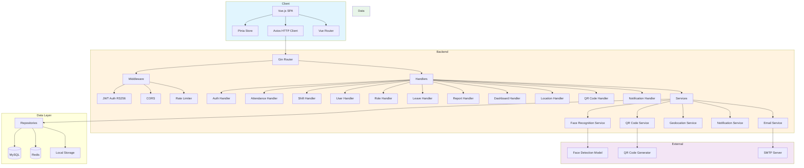
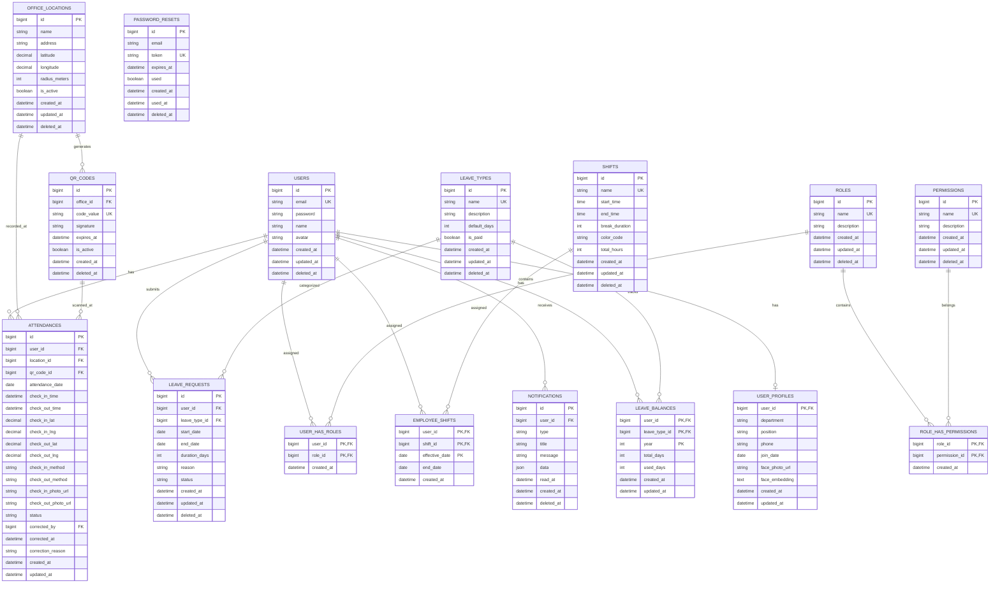

# Technical Design Document (TDD)

## 1. Tech Stack

| Component | Technology | Version | Purpose |
|-----------|------------|---------|---------|
| **Backend Framework** | Go (Golang) + Gin | 1.25+ | REST API development |
| **ORM** | GORM | Latest | Database operations |
| **Database** | MySQL | 8.0+ | Primary data storage |
| **Cache** | Redis | 7+ | Session cache, permission cache |
| **Authentication** | JWT (golang-jwt) RS256 | Latest | Asymmetric token-based auth |
| **Password Hashing** | bcrypt | Built-in | Secure password storage |
| **Validation** | go-playground/validator | Latest | Request validation |
| **Face Recognition** | GoCV / face-recognition-go | Latest | Face detection & matching |
| **QR Code** | tuotoo/qrcode | Latest | QR code generation & scanning |
| **File Storage** | Local Storage | - | Photo & document storage (`storage/`) |
| **Email** | net/smtp | Built-in | Password reset emails |
| **Logging** | Custom file-based logger | - | Structured logging with daily rotation |
| **Frontend Framework** | Vue.js 3 + TypeScript | 3.5+ | SPA development |
| **State Management** | Pinia | 3+ | Vue state management |
| **HTTP Client** | Axios | 1.14+ | API communication |
| **UI Components** | Custom (Tailwind CSS) | 4+ | Tailwind-based UI primitives |
| **Validation (FE)** | Vuelidate | 2+ | Form validation |
| **QR Scanner** | vue-qrcode-reader | Latest | QR code scanning |
| **Charts** | Chart.js / ECharts | Latest | Dashboard visualizations |
| **Export Excel** | xlsx (Go backend) | Latest | Excel export |
| **Export PDF** | gofpdf (Go backend) | Latest | PDF export |
| **Migration** | GORM AutoMigrate | Latest | Database migration |

## 2. System Architecture



### Architecture Pattern

```
Routes → Handlers → Services → Repositories → Database/Redis
              ↑
         Middleware (JWT RS256, CORS, Rate Limit, Permission)
```

All layers use **Dependency Injection** via `internal/di/container.go`.

### Directory Structure

```
be/
├── cmd/
│   ├── api/main.go              # Application entry point
│   ├── genkey/main.go           # RSA key pair generator for JWT
│   └── migration/               # DB migrations & seeders
│       ├── main.go
│       └── seeders/
├── internal/
│   ├── clients/email/           # SMTP email client
│   ├── database/                # MySQL, Redis connections
│   ├── di/                      # Dependency injection container
│   ├── dtos/                    # Request/Response DTOs
│   ├── handlers/                # HTTP handlers (single Handlers struct)
│   ├── helpers/                 # Utilities (JWT, crypto, response, logger, access)
│   ├── middleware/              # JWT, CORS, RBAC, rate limiting
│   ├── models/                  # GORM models (single struct per file)
│   ├── repositories/            # Data access layer (GenericRepository[T])
│   ├── routes/                  # Gin route definitions
│   └── services/                # Business logic (single Services struct)
├── storage/                     # Runtime files (logs, keys, uploads)
├── .env
├── go.mod
└── go.sum

fe/
├── src/
│   ├── api/                     # (via plugins/axios.ts)
│   ├── assets/                  # Icons, styles
│   ├── components/
│   │   ├── directives/          # v-click-outside
│   │   ├── layouts/             # SidebarMenu, TopBar, etc
│   │   └── utils/               # FormInput, UiButton, UiModal, UiTable, etc
│   ├── composables/             # useCrud, useFormError, withFile
│   ├── helpers/                 # date, storage, upload, vuelidate
│   ├── layouts/                 # DefaultLayout
│   ├── pages/                   # Page components
│   ├── plugins/                 # Axios interceptor, SweetAlert
│   ├── router/                  # Vue Router config
│   ├── stores/                  # Pinia stores
│   ├── App.vue
│   └── main.ts
├── .env
├── package.json
└── vite.config.ts
```

### Geolocation Validation

Server-side geotagging validation menggunakan **Haversine formula**:

```
a = sin²(Δφ/2) + cos φ1 ⋅ cos φ2 ⋅ sin²(Δλ/2)
c = 2 ⋅ atan2(√a, √(1−a))
d = R ⋅ c
```

Dimana:
- φ = latitude (radians), λ = longitude (radians)
- R = earth radius (6371 km)
- d = distance in meters

Jika `d <= office.radius_meters`, maka user dianggap dalam area kantor.

## 3. Entity Relationship Diagram (ERD)

### Existing Boilerplate Models (already implemented)

| Model | Table | Soft Delete | Key Fields |
|-------|-------|-------------|------------|
| `User` | `users` | Yes | id, email (unique), password, name, avatar |
| `Role` | `roles` | Yes | id, name (unique), description |
| `Permission` | `permissions` | Yes | id, name (unique), description |
| `UserHasRole` | `user_has_roles` | No | user_id, role_id (composite PK) |
| `RoleHasPermission` | `role_has_permissions` | No | role_id, permission_id (composite PK) |
| `PasswordReset` | `password_resets` | Yes | id, email, token (unique), expires_at, used |
| `Notification` | `notifications` | Yes | id, user_id, type, title, message, data (JSON), read_at |

### New HadirYuk Models (to be implemented)



### Enum Values

| Field | Possible Values |
|-------|-----------------|
| `ATTENDANCES.status` | `present`, `late`, `absent`, `leave` |
| `ATTENDANCES.check_in_method` | `geotagging`, `qr_code` |
| `LEAVE_REQUESTS.status` | `submitted`, `active`, `cancelled`, `expired` |
| `NOTIFICATIONS.type` | `info`, `warning`, `success`, `error` |

> **Note**: Leave requests have no approval workflow (per PRD). Status `submitted` means request is recorded, `active` means currently on leave, `cancelled` means employee cancelled, `expired` means past date without action.

### Leave Balance Initialization Strategy

- Saat employee baru dibuat: otomatis create `LEAVE_BALANCES` record untuk tahun berjalan
- Default days diambil dari `LEAVE_TYPES.default_days`
- Reset tahunan: cron job setiap 1 Januari reset `used_days = 0`, update `total_days` dari `LEAVE_TYPES`
- Employee resign: `LEAVE_BALANCES` di-retain untuk audit

## 4. API Contract

> All endpoints use base path `/api/` (not `/api/v1/`). Responses follow the boilerplate `Response` envelope.

### Authentication

| Endpoint | Method | Auth | Permission | Request Payload | Success Response |
|----------|--------|------|------------|-----------------|------------------|
| `/api/auth/login` | POST | ❌ | - | `{ "email": "string", "password": "string" }` | `{ "code": 200, "message": "...", "data": { "token": "...", "refresh_token": "...", "user": { "id": 1, "name": "...", "email": "...", "roles": ["..."] } } }` |
| `/api/auth/logout` | POST | ✅ | - | `{}` | `{ "code": 200, "message": "Logged out successfully" }` |
| `/api/auth/refresh` | POST | ❌ | - | `{ "refresh_token": "string" }` | `{ "code": 200, "message": "...", "data": { "token": "..." } }` |
| `/api/auth/change-password` | POST | ✅ | baseline | `{ "current_password": "string", "new_password": "string", "confirm_password": "string" }` | `{ "code": 200, "message": "Password changed successfully" }` |
| `/api/auth/forgot-password` | POST | ❌ | - | `{ "email": "string" }` | `{ "code": 200, "message": "Reset link sent to email" }` |
| `/api/auth/reset-password` | POST | ❌ | - | `{ "token": "string", "new_password": "string", "confirm_password": "string" }` | `{ "code": 200, "message": "Password reset successfully" }` |

### Attendance

| Endpoint | Method | Auth | Permission | Request Payload | Success Response |
|----------|--------|------|------------|-----------------|------------------|
| `/api/attendance/checkin` | POST | ✅ | baseline | `{ "latitude": float, "longitude": float, "photo": "base64" }` | `{ "code": 201, "message": "...", "data": { "id": 1, "check_in_time": "...", "status": "present" } }` |
| `/api/attendance/checkin/qr` | POST | ✅ | baseline | `{ "qr_code": "string" }` | `{ "code": 201, "message": "...", "data": { "id": 1, "check_in_time": "...", "status": "present" } }` |
| `/api/attendance/checkout` | POST | ✅ | baseline | `{ "latitude": float, "longitude": float, "photo": "base64" }` | `{ "code": 200, "message": "...", "data": { "id": 1, "check_out_time": "...", "duration": "8h 0m" } }` |
| `/api/attendance/checkout/qr` | POST | ✅ | baseline | `{ "qr_code": "string" }` | `{ "code": 200, "message": "...", "data": { "id": 1, "check_out_time": "...", "duration": "8h 0m" } }` |
| `/api/attendance/history` | GET | ✅ | baseline | `?date_from=...&date_to=...&page=1&page_size=20` | Paginated response |
| `/api/attendance/today` | GET | ✅ | baseline | - | `{ "code": 200, "message": "...", "data": { "status": "checked_in", "check_in_time": "...", "shift": {...} } }` |
| `/api/attendance/stats` | GET | ✅ | baseline | `?month=YYYY-MM` | `{ "code": 200, "message": "...", "data": { "present": 20, "late": 2, "absent": 1, "leave": 2 } }` |
| `/api/attendance/:id/correct` | PUT | ✅ | `attendance.correct` | `{ "check_in_time": "...", "check_out_time": "...", "reason": "string" }` | `{ "code": 200, "message": "...", "data": { "id": 1, "corrected_at": "..." } }` |
| `/api/attendance/late-statistics` | GET | ✅ | `late-statistic.view` | `?date_from=...&date_to=...&user_id=1` | Paginated response |

### Shift

| Endpoint | Method | Auth | Permission | Request Payload | Success Response |
|----------|--------|------|------------|-----------------|------------------|
| `/api/shifts` | POST | ✅ | `shift.create` | `{ "name": "string", "start_time": "08:00", "end_time": "17:00", "break_duration": 60, "color_code": "#FF0000" }` | `{ "code": 201, "message": "...", "data": { "id": 1, ... } }` |
| `/api/shifts` | GET | ✅ | baseline | `?page=1&page_size=20` | Paginated response |
| `/api/shifts/:id` | GET | ✅ | baseline | - | `{ "code": 200, "message": "...", "data": { "id": 1, ... } }` |
| `/api/shifts/:id` | PUT | ✅ | `shift.update` | `{ "name": "string", "start_time": "08:00", "end_time": "17:00", "break_duration": 60 }` | `{ "code": 200, "message": "...", "data": { "id": 1, ... } }` |
| `/api/shifts/:id` | DELETE | ✅ | `shift.delete` | - | `{ "code": 200, "message": "Shift deleted successfully" }` |
| `/api/shifts/assign` | POST | ✅ | `shift.assign` | `{ "user_ids": [1,2,3], "shift_id": 1, "effective_date": "...", "end_date": "..." }` | `{ "code": 200, "message": "Shift assigned successfully" }` |
| `/api/shifts/schedule` | GET | ✅ | baseline | `?user_id=1&month=YYYY-MM` | `{ "code": 200, "message": "...", "data": { "schedule": [...] } }` |

### Leave

| Endpoint | Method | Auth | Permission | Request Payload | Success Response |
|----------|--------|------|------------|-----------------|------------------|
| `/api/leave` | POST | ✅ | baseline | `{ "leave_type_id": 1, "start_date": "...", "end_date": "...", "reason": "string" }` | `{ "code": 201, "message": "...", "data": { "id": 1, ... } }` |
| `/api/leave` | GET | ✅ | baseline | `?page=1&page_size=20` | Paginated response |
| `/api/leave/balance` | GET | ✅ | baseline | - | `{ "code": 200, "message": "...", "data": { "annual": { "total": 12, "used": 5, "remaining": 7 }, ... } }` |
| `/api/leave/types` | GET | ✅ | baseline | - | Paginated response |
| `/api/leave/types` | POST | ✅ | `leave.manage-types` | `{ "name": "string", "default_days": 12, "is_paid": true }` | `{ "code": 201, "message": "...", "data": { "id": 1, ... } }` |
| `/api/leave/types/:id` | PUT | ✅ | `leave.manage-types` | `{ "name": "string", "default_days": 12, "is_paid": true }` | `{ "code": 200, "message": "...", "data": { "id": 1, ... } }` |
| `/api/leave/types/:id` | DELETE | ✅ | `leave.manage-types` | - | `{ "code": 200, "message": "Leave type deleted successfully" }` |

### User Management

| Endpoint | Method | Auth | Permission | Request Payload | Success Response |
|----------|--------|------|------------|-----------------|------------------|
| `/api/users` | POST | ✅ | `user.create` | `{ "name": "string", "email": "string", "phone": "string", "department": "string", "position": "string", "join_date": "..." }` | `{ "code": 201, "message": "...", "data": { "id": 1, ... } }` |
| `/api/users` | GET | ✅ | `user.index` | `?page=1&page_size=20&search=string` | Paginated response |
| `/api/users/:id` | GET | ✅ | `user.index` | - | `{ "code": 200, "message": "...", "data": { "id": 1, ... } }` |
| `/api/users/:id` | PUT | ✅ | `user.update` | `{ "name": "string", "phone": "string", "department": "string", "position": "string" }` | `{ "code": 200, "message": "...", "data": { "id": 1, ... } }` |
| `/api/users/:id` | DELETE | ✅ | `user.delete` | - | `{ "code": 200, "message": "User deactivated successfully" }` |
| `/api/users/:id/face-photo` | POST | ✅ | baseline | `multipart/form-data: { "photo": file }` | `{ "code": 200, "message": "Face photo uploaded successfully", "data": { "photo_url": "..." } }` |
| `/api/users/:id/roles` | POST | ✅ | `user.assign-role` | `{ "role_ids": [1, 2] }` | `{ "code": 200, "message": "Roles assigned successfully" }` |

### UAM (Role & Permissions)

| Endpoint | Method | Auth | Permission | Request Payload | Success Response |
|----------|--------|------|------------|-----------------|------------------|
| `/api/roles` | POST | ✅ | `role.create` | `{ "name": "string", "description": "string" }` | `{ "code": 201, "message": "...", "data": { "id": 1, ... } }` |
| `/api/roles` | GET | ✅ | `role.index` | `?page=1&page_size=20` | Paginated response |
| `/api/roles/:id` | GET | ✅ | `role.index` | - | `{ "code": 200, "message": "...", "data": { "id": 1, "permissions": [...] } }` |
| `/api/roles/:id` | PUT | ✅ | `role.update` | `{ "name": "string", "description": "string" }` | `{ "code": 200, "message": "...", "data": { "id": 1, ... } }` |
| `/api/roles/:id` | DELETE | ✅ | `role.delete` | - | `{ "code": 200, "message": "Role deleted successfully" }` |
| `/api/roles/:id/permissions` | PUT | ✅ | `role.assign-permission` | `{ "permission_ids": [1, 2, 3] }` | `{ "code": 200, "message": "Permissions assigned successfully" }` |
| `/api/permissions` | GET | ✅ | `permission.index` | - | Paginated response |
| `/api/permissions` | POST | ✅ | `permission.create` | `{ "name": "string", "description": "string" }` | `{ "code": 201, "message": "...", "data": { "id": 1, ... } }` |
| `/api/permissions/:id` | PUT | ✅ | `permission.update` | `{ "name": "string", "description": "string" }` | `{ "code": 200, "message": "...", "data": { "id": 1, ... } }` |
| `/api/permissions/:id` | DELETE | ✅ | `permission.delete` | - | `{ "code": 200, "message": "Permission deleted successfully" }` |

### Location

| Endpoint | Method | Auth | Permission | Request Payload | Success Response |
|----------|--------|------|------------|-----------------|------------------|
| `/api/locations` | POST | ✅ | `location.create` | `{ "name": "string", "address": "string", "latitude": float, "longitude": float, "radius_meters": 100 }` | `{ "code": 201, "message": "...", "data": { "id": 1, ... } }` |
| `/api/locations` | GET | ✅ | `location.index` | `?page=1&page_size=20` | Paginated response |
| `/api/locations/:id` | GET | ✅ | `location.index` | - | `{ "code": 200, "message": "...", "data": { "id": 1, ... } }` |
| `/api/locations/:id` | PUT | ✅ | `location.update` | `{ "name": "string", "address": "string", "latitude": float, "longitude": float, "radius_meters": 100 }` | `{ "code": 200, "message": "...", "data": { "id": 1, ... } }` |
| `/api/locations/:id` | DELETE | ✅ | `location.delete` | - | `{ "code": 200, "message": "Location deleted successfully" }` |

### QR Code Management

| Endpoint | Method | Auth | Permission | Request Payload | Success Response |
|----------|--------|------|------------|-----------------|------------------|
| `/api/qr-codes/generate` | POST | ✅ | `qrcode.generate` | `{ "office_id": 1, "expiry_minutes": 5 }` | `{ "code": 201, "message": "...", "data": { "id": 1, "code_value": "...", "qr_image": "base64", "expires_at": "..." } }` |
| `/api/qr-codes` | GET | ✅ | `qrcode.view` | `?office_id=1&page=1&page_size=20` | Paginated response |
| `/api/qr-codes/:id/revoke` | POST | ✅ | `qrcode.revoke` | `{}` | `{ "code": 200, "message": "QR code revoked successfully" }` |

### Dashboard

| Endpoint | Method | Auth | Permission | Request Payload | Success Response |
|----------|--------|------|------------|-----------------|------------------|
| `/api/dashboard/employee` | GET | ✅ | baseline | - | `{ "code": 200, "message": "...", "data": { "today_status": "...", "check_in_time": "...", "shift": {...}, "monthly_summary": {...}, "week_schedule": [...] } }` |
| `/api/dashboard/hr` | GET | ✅ | `dashboard.view-hr` | `?date=YYYY-MM-DD` | `{ "code": 200, "message": "...", "data": { "today_stats": {...}, "weekly_chart": [...], "not_attended": [...], "recent_leaves": [...] } }` |
| `/api/dashboard/admin` | GET | ✅ | `dashboard.view-admin` | `?date=YYYY-MM-DD` | `{ "code": 200, "message": "...", "data": { "system_stats": {...}, "recent_activity": [...], "system_health": {...} } }` |

### Report

| Endpoint | Method | Auth | Permission | Request Payload | Success Response |
|----------|--------|------|------------|-----------------|------------------|
| `/api/reports/attendance` | GET | ✅ | `report.view` | `?date_from=...&date_to=...&user_id=1&department=...&status=...` | `{ "code": 200, "message": "...", "data": [...], "metadata": { "total": 100, ... } }` |
| `/api/reports/attendance/export/excel` | GET | ✅ | `report.export-excel` | `?date_from=...&date_to=...` | `File download (.xlsx)` |
| `/api/reports/attendance/export/pdf` | GET | ✅ | `report.export-pdf` | `?date_from=...&date_to=...` | `File download (.pdf)` |
| `/api/reports/leave` | GET | ✅ | `report.view` | `?date_from=...&date_to=...` | `{ "code": 200, "message": "...", "data": [...], "metadata": { "total": 50, ... } }` |
| `/api/reports/leave/export/excel` | GET | ✅ | `report.export-excel` | `?date_from=...&date_to=...` | `File download (.xlsx)` |
| `/api/reports/leave/export/pdf` | GET | ✅ | `report.export-pdf` | `?date_from=...&date_to=...` | `File download (.pdf)` |

### Profile

| Endpoint | Method | Auth | Permission | Request Payload | Success Response |
|----------|--------|------|------------|-----------------|------------------|
| `/api/me` | GET | ✅ | baseline | - | `{ "code": 200, "message": "...", "data": { "id": 1, "name": "...", "email": "...", "avatar": "..." } }` |
| `/api/me` | PUT | ✅ | baseline | `{ "name": "string", "avatar": "string" }` | `{ "code": 200, "message": "...", "data": { "id": 1, ... } }` |

### Notifications (boilerplate existing)

| Endpoint | Method | Auth | Permission | Request Payload | Success Response |
|----------|--------|------|------------|-----------------|------------------|
| `/api/notifications` | GET | ✅ | - | `?page=1&page_size=20&type=...&read=true` | Paginated response |
| `/api/notifications/unread-count` | GET | ✅ | - | - | `{ "code": 200, "message": "...", "data": { "count": 5 } }` |
| `/api/notifications/:id` | GET | ✅ | - | - | `{ "code": 200, "message": "...", "data": { "id": 1, ... } }` |
| `/api/notifications/:id/read` | PATCH | ✅ | - | - | `{ "code": 200, "message": "Notification marked as read" }` |
| `/api/notifications/mark-all-read` | PATCH | ✅ | - | - | `{ "code": 200, "message": "All notifications marked as read" }` |
| `/api/notifications/:id` | DELETE | ✅ | - | - | `{ "code": 200, "message": "Notification deleted" }` |

### System (boilerplate existing)

| Endpoint | Method | Auth | Permission | Success Response |
|----------|--------|------|------------|------------------|
| `/health` | GET | ❌ | - | `{ "code": 200, "message": "OK", "data": { "status": "healthy", "components": {...} } }` |
| `/.well-known/jwks.json` | GET | ❌ | - | JWKS public key response |
| `/api/upload` | POST | ✅ | - | `{ "code": 200, "message": "...", "data": { "uuid": "...", "url": "/storage/tmp/..." } }` |

## 5. Permission-to-API Mapping

> **Note:** Endpoints dengan permission `baseline` tidak memerlukan permission spesifik — semua authenticated user dapat mengaksesnya.

| Permission | Protected Endpoints |
|------------|---------------------|
| `attendance.view-all` | GET /api/attendance/history?user_id=all |
| `attendance.export` | GET /api/reports/attendance/export/* |
| `attendance.correct` | PUT /api/attendance/:id/correct |
| `shift.create` | POST /api/shifts |
| `shift.update` | PUT /api/shifts/:id |
| `shift.delete` | DELETE /api/shifts/:id |
| `shift.assign` | POST /api/shifts/assign |
| `leave.view-all` | GET /api/leave?user_id=all |
| `leave.manage-types` | CRUD /api/leave/types |
| `user.index` | GET /api/users, GET /api/users/:id |
| `user.create` | POST /api/users |
| `user.update` | PUT /api/users/:id |
| `user.delete` | DELETE /api/users/:id |
| `user.assign-role` | POST /api/users/:id/roles |
| `role.index` | GET /api/roles, GET /api/roles/:id |
| `role.create` | POST /api/roles |
| `role.update` | PUT /api/roles/:id |
| `role.delete` | DELETE /api/roles/:id |
| `role.assign-permission` | PUT /api/roles/:id/permissions |
| `permission.index` | GET /api/permissions |
| `permission.create` | POST /api/permissions |
| `permission.update` | PUT /api/permissions/:id |
| `permission.delete` | DELETE /api/permissions/:id |
| `location.index` | GET /api/locations, GET /api/locations/:id |
| `location.create` | POST /api/locations |
| `location.update` | PUT /api/locations/:id |
| `location.delete` | DELETE /api/locations/:id |
| `dashboard.view-hr` | GET /api/dashboard/hr |
| `dashboard.view-admin` | GET /api/dashboard/admin |
| `report.view` | GET /api/reports/* |
| `report.export-excel` | GET /api/reports/*/export/excel |
| `report.export-pdf` | GET /api/reports/*/export/pdf |
| `qrcode.generate` | POST /api/qr-codes/generate |
| `qrcode.view` | GET /api/qr-codes |
| `qrcode.revoke` | POST /api/qr-codes/:id/revoke |
| `late-statistic.view` | GET /api/attendance/late-statistics |
| `audit.view` | GET /api/audit-logs |

## 6. API Response Standard

### Success Response Envelope

```json
{
  "code": 200,
  "message": "Roles fetched successfully",
  "data": []
}
```

### Paginated Response Envelope

```json
{
  "code": 200,
  "message": "Roles fetched successfully",
  "data": [],
  "metadata": {
    "total": 4,
    "page": 1,
    "page_size": 12,
    "total_pages": 1
  }
}
```

### Validation Error Response (422)

```json
{
  "code": 422,
  "message": "Validation failed",
  "errors": {
    "field": ["message 1", "message 2"]
  }
}
```

### HTTP Status Code Mapping

| Status | Usage |
|--------|-------|
| 200 | Success (GET, PUT, PATCH, POST) |
| 201 | Created (POST) |
| 204 | No Content (DELETE) |
| 400 | Bad Request (invalid payload format) |
| 401 | Unauthorized (missing/invalid token) |
| 403 | Forbidden (insufficient permission) |
| 404 | Not Found |
| 409 | Conflict (duplicate resource) |
| 422 | Unprocessable Entity (validation error) |
| 429 | Too Many Requests (rate limit) |
| 500 | Internal Server Error |

## 7. Infrastructure & Security

### JWT Authentication (RS256 Asymmetric)

```
Key Management:
- RSA 2048-bit key pair generated via cmd/genkey/main.go
- Private key: encrypted with AES-256 + passphrase, stored at storage/keys/private.pem
- Public key: PEM format, stored at storage/keys/public.pem
- Key ID (kid): SHA-256 fingerprint of public key (first 8 hex chars)

Access Token:
- Algorithm: RS256
- Expiry: 24 hours (configurable via JWT_EXPIRY_HOURS)
- Payload: { user_id, email, iat, exp }
- Header: { alg: "RS256", kid: "..." }

Refresh Token:
- Algorithm: RS256
- Expiry: 168 hours (7 days)
- Payload: { user_id, email, iat, exp }

Session Validation:
- L1: Redis cache (session:{userID}) with TTL = JWT expiry
- L2: Database user lookup (status check)
- No token blacklist — session invalidation via Redis cache deletion on logout
```

### Password Policy

- Minimum 8 characters
- Bcrypt cost factor: 12
- Default password generated for new employees (sent via email or shown once)

### Data Encryption

- Passwords: bcrypt hashing
- Face embeddings: stored as text in database
- JWT keys: RSA asymmetric, private key AES-256 encrypted
- Database connection: configurable SSL

### API Security

- CORS: configurable origins via `CORS_ALLOWED_ORIGINS`
- Rate limiting: token bucket (in-memory), configurable via `RATE_LIMIT_REQUESTS` / `RATE_LIMIT_WINDOW`
- Input validation: go-playground/validator with JSON tag names
- SQL injection prevention: GORM parameterized queries
- Permission middleware: per-endpoint permission checks via `RequirePermission(acc, "permission.name")`

### Database Configuration

```
Connection Pool:
- Max Open Connections: 25
- Max Idle Connections: 10
- Connection Lifetime: 1 hour
```

### Indexing Strategy

| Table | Index | Type |
|-------|-------|------|
| users | email | UNIQUE |
| permissions | name | UNIQUE |
| roles | name | UNIQUE |
| password_resets | token | UNIQUE |
| attendances | user_id + attendance_date | COMPOSITE |
| attendances | attendance_date | BTREE |
| attendances | qr_code_id | BTREE |
| leave_requests | user_id + status | COMPOSITE |
| leave_balances | user_id + leave_type_id + year | COMPOSITE UNIQUE |
| employee_shifts | user_id + shift_id + effective_date | COMPOSITE PK |
| qr_codes | code_value | UNIQUE |
| qr_codes | office_id + is_active + expires_at | COMPOSITE |
| office_locations | name | BTREE |
| shifts | name | UNIQUE |
| leave_types | name | UNIQUE |

### Environment Variables

```env
# Server
PORT=8080
GIN_MODE=release

# Database
DB_CONNECTION=mysql
DB_HOST=localhost
DB_PORT=3306
DB_USER=hadiryuk_user
DB_PASSWORD=your_secure_password
DB_NAME=hadiryuk_db

# Redis
REDIS_ENABLED=true
REDIS_HOST=localhost
REDIS_PORT=6379
REDIS_PASSWORD=
REDIS_DB=0

# JWT (RS256)
JWT_PRIVATE_KEY_PATH=storage/keys/private.pem
JWT_PUBLIC_KEY_PATH=storage/keys/public.pem
JWT_PASSPHRASE=your_passphrase
JWT_EXPIRY_HOURS=24
JWT_REFRESH_EXPIRY_HOURS=168

# Email
SMTP_HOST=smtp.gmail.com
SMTP_PORT=587
SMTP_USER=your_email@gmail.com
SMTP_PASSWORD=your_app_password
SMTP_FROM=HadirYuk <noreply@hadiryuk.com>

# CORS
CORS_ALLOWED_ORIGINS=http://localhost:5173

# Rate Limiting
RATE_LIMIT_REQUESTS=100
RATE_LIMIT_WINDOW=60

# Face Recognition
FACE_MODEL_PATH=./models/face_model.dat
FACE_THRESHOLD=0.85
FACE_PHOTO_MAX_SIZE=2097152

# File Storage
STORAGE_PATH=./storage
MAX_UPLOAD_SIZE=2097152

# Logging
LOG_LEVEL=info
```

### Health Check Endpoints

| Endpoint | Description |
|----------|-------------|
| `/health` | Basic health check (DB ping, Redis ping) |

### Migration & Seed

```
Migration CLI (cmd/migration/main.go):
- up: GORM AutoMigrate for all models
- down: Drop tables in reverse FK order
- seed: Run seeders (permissions, roles, users, role-permission mapping, user-role mapping)
- refresh: down + up + seed

Default Seed Data:
- Permissions: user.*, role.*, permission.* (12 CRUD permissions)
- Roles: Super Admin, Admin, Editor, Viewer
- Users: suAdmin@app.com, admin@app.com, editor@app.com, viewer@app.com
```
