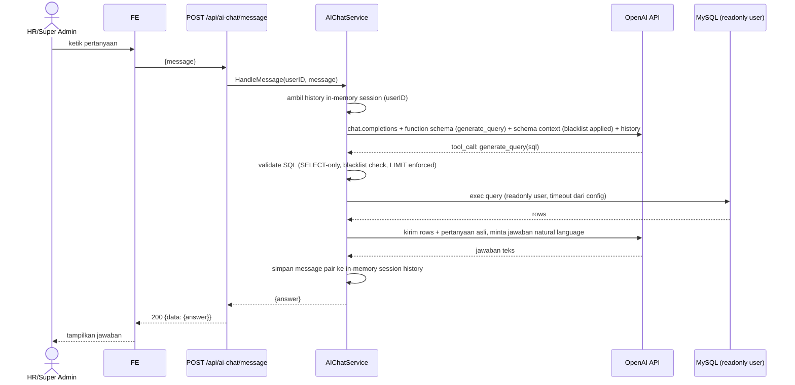

# AI Customer Service Chatbot (Text-to-SQL)

Plan fitur berdiri sendiri. Tidak mengubah `01_PRD.md`–`05_ITL.md` atau CHANGELOG-nya — ini fitur tambahan dengan scope terpisah.

## 1. Ringkasan

### Tujuan
Super Admin / HR Admin bisa tanya data pakai bahasa natural ("berapa karyawan yang telat bulan ini?") dan dapat jawaban yang digenerate dari data absensi live, tanpa nulis SQL manual.

### Bukan Tujuan (eksplisit di luar scope iterasi ini)
- Akses role Karyawan — tidak termasuk
- Chat history persisten di DB — session-only, in-memory
- Streaming response (SSE) — request/response biasa
- Query preview/confirm, EXPLAIN-based query cost guard, fallback query template, export chat — semua di-skip dulu, tambah nanti kalau perlu

### User Stories

| ID | Role | Kebutuhan | Manfaat | Prioritas |
|----|------|-------------|---------|----------|
| US-AI-01 | HR Admin | Bertanya soal data absensi dalam bahasa natural | Gak perlu SQL/report manual buat pertanyaan ad-hoc | Must |
| US-AI-02 | Super Admin | Sama seperti US-AI-01 | Sama | Must |
| US-AI-03 | HR Admin/Super Admin | Melanjutkan percakapan (follow-up question) dalam satu sesi login | Konteks pertanyaan sebelumnya kepake, gak perlu ulang konteks | Should |
| US-AI-04 | HR Admin/Super Admin | Reset percakapan | Mulai topik baru tanpa histori lama nyangkut di context | Should |

## 2. Alur Fungsional



### Logika Bisnis

1. **Session scope**: chat history disimpan in-memory di backend, keyed by `user_id` dari JWT (bukan cookie/session-id terpisah — JWT yang udah ada cukup buat identifikasi). Bukan per browser tab/device — satu user = satu history aktif, dari manapun dia request.
2. **Session lifetime**: history TTL (config `AI_CHAT_SESSION_TTL_MINUTES`, default 1440 / 24 jam sejak aktivitas terakhir). Expired session dianggap kosong, mulai fresh. History juga di-clear total (`ClearSession(userID)` — hapus entry map, bukan cuma reset counter) saat user hit endpoint reset (§4). Logout **tidak** clear session — history tetap ada sampai TTL habis atau user reset manual, biar user bisa lanjut chat lagi pas login ulang.
3. **History cap — dua level, beda tujuan**:
   - **Stored history** (buat "chat ulang" / scrollback di UI): max `AI_CHAT_MAX_STORED_MESSAGES` (default 100) pesan gabungan user+AI per session. Lewat batas ini, pesan terlama di-evict (FIFO).
   - **Context ke OpenAI** (buat kontrol token cost): tiap request cuma `AI_CHAT_MAX_CONTEXT_MESSAGES` (default 10) pesan terakhir dari stored history yang dikirim sebagai context — bukan semua 100. Biar percakapan panjang gak bikin token cost membengkak, tapi user tetap bisa scroll balik liat history penuh di UI.
4. **Query generation**: pakai OpenAI function calling / tool use — model **wajib** manggil tool `generate_query(sql: string)`, gak boleh nulis SQL bebas di teks jawaban. Kalau model gak manggil tool sama sekali (nolak/gak relevan), balikin jawabannya langsung sebagai teks tanpa eksekusi query.
5. **Query validation** (sebelum eksekusi, defense in depth — lihat §6 Security):
   - Harus `SELECT` — reject kalau ada `INSERT`/`UPDATE`/`DELETE`/`DROP`/`ALTER`/`TRUNCATE`/multiple statements (`;` selain di akhir).
   - Reject kalau menyentuh tabel/kolom yang ada di blacklist (§6.2).
   - Kalau query gak punya `LIMIT`, backend inject `LIMIT` dari config (`AI_CHAT_MAX_ROWS`, default 100).
   - Kalau validasi gagal → gak eksekusi, balikin error message ke user ("Pertanyaan ini gak bisa diproses, coba pertanyaan lain seputar data absensi/karyawan/shift").
6. **Query execution**: pakai DB connection terpisah dengan MySQL user readonly (`GRANT SELECT`), context timeout dari config (`AI_CHAT_QUERY_TIMEOUT_SECONDS`, default 10s).
7. **Answer formatting**: hasil rows (di-cap juga jumlah row yang dikirim balik ke OpenAI biar gak boros token, misal max 50 row mentah) dikirim lagi ke OpenAI buat diformat jadi kalimat natural language.
8. **Rate limiting — pembatasan penggunaan AI, bukan rate limit HTTP biasa**: dua layer, masing-masing fixed-window sendiri (reuse `helpers.RateLimiter` yang udah ada di `ratelimit.go` — konstruktornya udah generic nerima `limit` + `windowSecs`, tinggal instantiate 2x dengan window beda):
   - **Global** (`ai_chat_global` limiter, key konstan): max `AI_CHAT_RATE_LIMIT_GLOBAL_MAX` pemakaian AI (default 200) dalam window 4 jam (hardcoded, bukan `.env`) — jaga total biaya OpenAI di seluruh sistem.
   - **Per-user** (`ai_chat_user` limiter, key = `user_id`): max `AI_CHAT_RATE_LIMIT_USER_MAX` pemakaian AI (default 20) dalam window 1 jam (hardcoded, bukan `.env`) — cegah 1 user ngabisin kuota global sendirian.
   - Kedua limiter dicek sebelum call OpenAI (bukan di level HTTP middleware biasa, karena yang mau dibatasi itu *pemakaian AI*, bukan hit endpoint — reset endpoint (§4) gak masuk hitungan limiter ini).
   - Kena salah satu limit → 429, response envelope error standar, pesan beda tergantung mana yang kena ("Batas penggunaan AI global tercapai, coba lagi nanti" vs "Batas penggunaan AI kamu tercapai, coba lagi dalam 1 jam").

## 3. Elemen Layar

### §3.1 Chat Widget

| Elemen | Tipe | Aturan Validasi |
|---------|------|-------------------|
| Message input | Textarea | Wajib diisi, max 500 karakter |
| Send button | Button | Disabled saat request in-flight atau input kosong |
| Reset conversation button | Button | Confirm dialog sebelum clear |
| Chat bubble list | Read-only list | Pesan user vs jawaban AI, urut kronologis |

## 4. Kontrak API

Base path `/api/ai-chat`. Response envelope ikut standar project (`04_TDD.md` §6).

| Endpoint | Method | Auth | Permission | Request | Response Sukses |
|----------|--------|------|------------|---------|-------------------|
| `/api/ai-chat/message` | POST | Ya | `ai-chat.query` | `{"message": "string"}` | `{code:200, data:{answer:"string"}}` |
| `/api/ai-chat/history` | GET | Ya | `ai-chat.query` | — | `{code:200, data:{messages:[Message]}}` |
| `/api/ai-chat/reset` | POST | Ya | `ai-chat.query` | — | `{code:200, data:null}` |

`Message` shape: `{"role": "user"|"assistant", "content": "string", "created_at": "ISO8601"}` — sama persis yang dipakai `AIChatSessionStore` internal, dipakai FE buat render scrollback (§3.1) pas widget dibuka/reload, urut lama→baru, max `AI_CHAT_MAX_STORED_MESSAGES` item. Session belum ada / expired → `messages: []`, bukan 404.

Kasus error: 400 (message kosong/terlalu panjang), 403 (permission ditolak), 422 (query generation gagal validasi — pesan generik ke user), 429 (rate limit), 500 (OpenAI API error / DB error).

## 5. Role & Permission

### Permission

| Permission | Module | Action | Deskripsi |
|------------|--------|--------|--------------|
| `ai-chat.query` | ai-chat | query | Akses fitur AI CS chatbot (kirim pertanyaan & reset percakapan) |

### Matriks

| Permission | Super Admin | HR Admin | Karyawan |
|------------|:---:|:---:|:---:|
| `ai-chat.query` | ✅ | ✅ | ❌ |

Ditambahkan lewat seeder permission yang udah ada (`role_has_permissions`), gak perlu tabel baru.

## 6. Keamanan

### §6.1 Koneksi DB Readonly
Bikin MySQL user baru khusus AI chat, misal `hadiryuk_ai_ro`. `users` dikecualikan dari grant tabel penuh — cuma kolom `id` dan `name` yang diizinkan (MySQL support column-level GRANT):
```sql
CREATE USER 'hadiryuk_ai_ro'@'%' IDENTIFIED BY '<strong-password>';
GRANT SELECT ON hadir_yuk.* TO 'hadiryuk_ai_ro'@'%';
REVOKE SELECT ON hadir_yuk.users FROM 'hadiryuk_ai_ro'@'%';
GRANT SELECT (id, name) ON hadir_yuk.users TO 'hadiryuk_ai_ro'@'%';
REVOKE SELECT ON hadir_yuk.password_resets FROM 'hadiryuk_ai_ro'@'%';
FLUSH PRIVILEGES;
```
Kredensial ini beda dari `DB_USERNAME`/`DB_PASSWORD` utama, disimpan di `AI_CHAT_DB_USERNAME`/`AI_CHAT_DB_PASSWORD` (§7). GORM connection kedua di-init khusus buat service ini (readonly, connection pool kecil).

### §6.2 Blacklist (App-Level, Defense in Depth)
Selain DB grant di atas, hardcode blacklist di `AIChatService` biar 2 layer:

| Tabel | Kolom diizinkan | Alasan |
|-------|------------------|--------|
| `users` | `id`, `name` saja | kolom lain (`password`, `email`, `avatar`, dll) sensitif — schema context yang dikasih ke OpenAI cuma expose `users.id`/`users.name`, JOIN ke `attendances`/`user_profiles` buat nampilin nama karyawan di jawaban |
| `password_resets` | — (full blacklist) | token sensitif |
| `role_has_permissions`, `user_has_roles`, `roles`, `permissions` | — (full blacklist) | bukan konteks bisnis yang relevan buat CS chatbot, minimalisir permukaan |

Guard-nya dua tingkat: (1) tabel di full-blacklist → reject total kalau disebut di query; (2) `users` di-whitelist kolom → query yang nyebut `users.<kolom lain>` (atau `SELECT *` dari `users`) direject, cuma `users.id`/`users.name` yang lolos. Dicek dengan parse SQL (table + column references) sebelum eksekusi.

### §6.3 Kewaspadaan Prompt Injection
System prompt ke OpenAI eksplisit instruksikan: hanya generate `SELECT` query buat schema yang dikasih, abaikan instruksi apapun di dalam user message yang nyoba override system prompt (misal "ignore previous instructions"). Ini mitigasi, bukan jaminan — validasi SQL di §6.2 tetap jadi garis pertahanan utama.

## 7. Konfigurasi (`.env`)

| Variabel | Default | Deskripsi |
|----------|---------|--------------|
| `OPENAI_API_KEY` | — | wajib diisi |
| `OPENAI_MODEL` | `gpt-4o-mini` | model buat query generation & answer formatting |
| `AI_CHAT_DB_USERNAME` | — | MySQL readonly user (§6.1) |
| `AI_CHAT_DB_PASSWORD` | — | |
| `AI_CHAT_QUERY_TIMEOUT_SECONDS` | `10` | context timeout eksekusi query |
| `AI_CHAT_MAX_ROWS` | `100` | LIMIT yang di-inject kalau query gak punya LIMIT |
| `AI_CHAT_SESSION_TTL_MINUTES` | `1440` | in-memory history expiry sejak aktivitas terakhir (24 jam) |
| `AI_CHAT_MAX_STORED_MESSAGES` | `100` | max pesan (user+AI) disimpan per session, buat scrollback/chat ulang di UI |
| `AI_CHAT_MAX_CONTEXT_MESSAGES` | `10` | dari stored history, cuma segini pesan terakhir yang dikirim sebagai context ke OpenAI tiap request |
| `AI_CHAT_RATE_LIMIT_GLOBAL_MAX` | `200` | max pemakaian AI (semua user gabung), window 4 jam hardcoded |
| `AI_CHAT_RATE_LIMIT_USER_MAX` | `20` | max pemakaian AI per user, window 1 jam hardcoded |

## 8. Arsitektur / Direktori

Ikut struktur existing (`04_TDD.md` §2 Directory Structure) & pola `clients/email/`, `clients/face/` — integrasi eksternal & state hidup di `clients/`, service cuma orchestrate. File baru:

```
be/internal/
├── clients/openai/
│   ├── openai_client.go        # thin wrapper: chat completion + function calling
│   ├── openai_dto.go
│   ├── session_store.go        # standalone: sync.Map[userID]*Session + TTL cleanup goroutine
│   │                            # gak import model/gorm/gin — cuma stdlib + openai_dto types.
│   │                            # exported: Store, NewStore(ttl, maxStored),
│   │                            # (*Store).Append(userID, msg), .ContextMessages(userID, n),
│   │                            # .All(userID), .Clear(userID)
│   └── session_store_test.go   # self-check: TTL expiry, FIFO evict, Clear
├── dtos/
│   └── ai_chat_dto.go          # request/response DTOs
├── handlers/
│   └── ai_chat_handler.go
├── services/
│   └── ai_chat_service.go      # orchestrasi: prompt build, validate, execute, format —
│                                # history-nya cukup teruskan panggilan ke clients/openai.Store, gak reimplement
├── helpers/
│   └── sql_guard.go            # SELECT-only check, blacklist check, LIMIT injection
├── routes/
│   └── ai_chat_route.go
└── database/
    └── ai_readonly.go          # GORM connection kedua pakai AI_CHAT_DB_* creds
```

`clients/openai` standalone artinya bisa di-`go test` tanpa nyeret DB/HTTP/model project — cuma nerima/balikin struct-nya sendiri (`Message{Role, Content, CreatedAt}`). Config (TTL, max stored, max context) dari `.env` di-inject ke `NewStore(...)` sekali di `di/` (dependency injection existing), `AIChatService` tinggal panggil method `Store`/`Client` tiap butuh baca/tulis history atau call OpenAI.

> ponytail: session store pakai single `sync.Map` in-process — gak shared antar instance kalau nanti scale horizontal. Upgrade ke Redis kalau multi-instance deployment jadi kebutuhan nyata (docker-compose saat ini single instance).

## 9. Task Implementasi

### T-AI-01: Readonly DB User & Koneksi GORM Kedua
- **Prioritas:** P0 · **Estimasi:** 2h · **Status:** [ ]
- Bikin MySQL user readonly (§6.1), init GORM connection kedua di `database/ai_readonly.go` pakai `AI_CHAT_DB_*` env.

### T-AI-02: SQL Guard Helper
- **Prioritas:** P0 · **Estimasi:** 3h · **Status:** [ ]
- `helpers/sql_guard.go`: validasi SELECT-only, blacklist table check + column-level whitelist khusus `users` (id, name — §6.2), LIMIT injection.
- Self-check: table-driven test kecil (`sql_guard_test.go`) — valid SELECT lolos, DML ditolak, `SELECT password FROM users` ditolak, `SELECT id, name FROM users` lolos, query tanpa LIMIT ke-inject LIMIT.

### T-AI-03: OpenAI Client
- **Prioritas:** P0 · **Estimasi:** 3h · **Status:** [ ]
- `clients/openai/`: chat completion call dengan function/tool definition `generate_query(sql: string)`, timeout & error handling.
- **TDD Ref:** §7 Konfigurasi — `OPENAI_API_KEY`, `OPENAI_MODEL`

### T-AI-04: `clients/openai` — In-Memory Session Store (Standalone)
- **Prioritas:** P0 · **Estimasi:** 3h · **Status:** [ ]
- `clients/openai/session_store.go`, standalone (§8) — gak import `models`/gorm/gin: `sync.Map[userID]*Session{Messages, LastActivity}`, background goroutine sweep tiap 1 menit buat evict expired (TTL & max stored di-pass sebagai parameter ke `NewStore(...)`, bukan baca `.env` langsung — biar tetap standalone/testable, config-nya diinject dari `internal/di`). `Messages` di-cap FIFO ke max stored. Method `ContextMessages(userID, n)` balikin `n` pesan terakhir buat context ke OpenAI (§2 poin 3), `Clear(userID)` buat reset.
- Self-check: `session_store_test.go` — TTL expiry, FIFO evict, `Clear`.

### T-AI-05: AIChatService — Penanganan Pesan
- **Prioritas:** P0 · **Estimasi:** 5h · **Status:** [ ]
- Orkestrasi flow lengkap di §2: ambil history dari `clients/openai.Store` (service cuma meneruskan panggilan, gak reimplement logic store) → build schema context (exclude blacklist) → call OpenAI generate_query → SQL guard → exec via readonly connection → call OpenAI format answer → `Store.Append(...)`.
- **FSD Ref:** §2 Logika Bisnis poin 1-7

### T-AI-06: Endpoint POST /api/ai-chat/message
- **Prioritas:** P0 · **Estimasi:** 2h · **Status:** [ ]
- Handler + route + middleware (`RequirePermission(acc, "ai-chat.query")`).
- **TDD Ref:** §4 Kontrak API — `POST /api/ai-chat/message`
- **E2E Scenario (Given-When-Then):**
  - **Given** user login sebagai HR Admin dan buka chat widget
  - **When** kirim pertanyaan "berapa karyawan yang telat bulan ini?"
  - **Then** dapat jawaban natural language berisi angka, tanpa expose SQL mentah ke response

### T-AI-07: Endpoint POST /api/ai-chat/reset
- **Prioritas:** P1 · **Estimasi:** 1h · **Status:** [ ]
- Clear session in-memory user yang bersangkutan.
- **TDD Ref:** §4 Kontrak API — `POST /api/ai-chat/reset`
- **E2E Scenario:**
  - **Given** user punya history percakapan aktif
  - **When** klik "Reset conversation"
  - **Then** history kehapus, pertanyaan berikutnya gak bawa konteks lama

### T-AI-08: Dual Rate Limiter Pemakaian AI (Global + Per-User)
- **Prioritas:** P1 · **Estimasi:** 2h · **Status:** [ ]
- 2 instance `helpers.RateLimiter` khusus dicek sebelum call OpenAI (bukan middleware HTTP): global (key konstan, window 4 jam hardcoded) + per-user (key `user_id`, window 1 jam hardcoded), limit angka dari `AI_CHAT_RATE_LIMIT_GLOBAL_MAX`/`AI_CHAT_RATE_LIMIT_USER_MAX`.
- **TDD Ref:** §2 Logika Bisnis poin 8

### T-AI-12: Endpoint GET /api/ai-chat/history
- **Prioritas:** P1 · **Estimasi:** 1h · **Status:** [ ]
- Handler + route, ambil `Messages` dari session store buat `user_id` yang login (tanpa call OpenAI), balikin `[]` kalau session gak ada/expired.
- **TDD Ref:** §4 Kontrak API — `GET /api/ai-chat/history`
- **E2E Scenario (Given-When-Then):**
  - **Given** user punya percakapan aktif dari sesi login sebelumnya (belum expired)
  - **When** buka/reload chat widget
  - **Then** history lama muncul lagi urut lama→baru, tanpa perlu tanya ulang

### T-AI-09: Permission Seeder — `ai-chat.query`
- **Prioritas:** P0 · **Estimasi:** 1h · **Status:** [ ]
- Tambah permission ke seeder, assign ke Super Admin & HR Admin role.
- **Role Matrix Ref:** §5 Role & Permission

### T-AI-11: FE Chat Widget
- **Prioritas:** P1 · **Estimasi:** 5h · **Status:** [ ]
- Textarea + send + reset + bubble list (§3.1), non-streaming (tunggu response lalu tampil).
- **E2E Scenario:** sama seperti T-AI-06/T-AI-07, dari sisi UI.

### Ringkasan

| Fase | Task |
|-------|-------|
| Fase 1 — Fondasi | T-AI-01, T-AI-02, T-AI-03, T-AI-09 |
| Fase 2 — Inti | T-AI-04, T-AI-05, T-AI-06, T-AI-07, T-AI-12 |
| Fase 3 — Hardening & UI | T-AI-08, T-AI-11 |

Total 11 task, 0 selesai.
